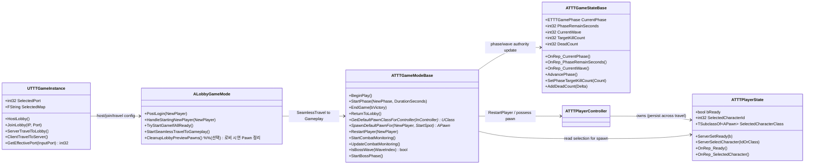
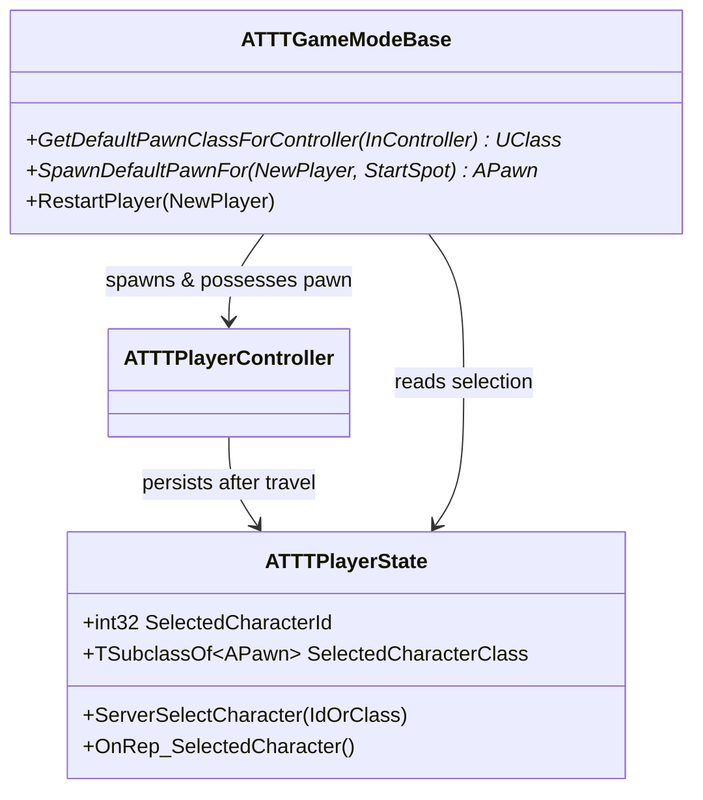

# TenTenTown – Server GameFlow 기술 명세 (SeamlessTravel / Phase / Spawn)

## 0) 범위 (Scope)

본 문서는 TenTenTown의 **서버 권한(Server Authority)** 기반 게임 진행을 담당하는 핵심 흐름을 정의합니다.

* Dedicated Server 환경 기준
* 로비 → 인게임 SeamlessTravel 전환
* 플레이어 “선택 캐릭터” 기반 **인게임 Pawn 재스폰**
* GameMode/GameState 기반 **Phase(Build/Combat/Reward) 진행**
* Wave 진행 및 종료 조건(킬 카운트 기반 등)과 연계

---

## 1) 핵심 설계 원칙

### 1.1 SeamlessTravel 객체 생존 규칙 준수

* **유지됨:** `PlayerController`, `PlayerState`
* **재생성됨:** `GameMode`, `GameState`, `Pawn`, 월드 액터

따라서 로비에서 스폰한 Pawn을 들고 가는 방식이 아니라
**“선택 정보는 PlayerState에 저장”**하고,
**인게임 GameMode에서 Pawn을 새로 스폰**하는 구조를 표준으로 삼습니다.

### 1.2 스폰 권한은 서버 단일화

* Pawn 생성/소유권/RestartPlayer는 항상 **서버에서만 확정**
* 클라이언트는 “선택 정보 전달”만 수행

---

## 2) 책임 분리 (Responsibilities)

### 2.1 `UTTTGameInstance` (Travel/Join/Host 설정)

* Host/Join 입력값(서버 주소, 포트, 목표 맵 등)을 유지
* Travel 명령을 “요청/수행”하는 진입점 제공
* 전투 로직/스폰 로직은 소유하지 않음 (GameMode 책임)

### 2.2 `ALobbyGameMode` (로비 상태 관리 및 Travel 트리거)

* PostLogin 이후 로비 참가 처리
* 플레이어 Ready 조건을 만족하면 SeamlessTravel 트리거
* 로비 시연용 Pawn이 존재할 경우 Travel 전에 정리(선택)

### 2.3 `ATTTPlayerState` (선택/준비 상태의 단일 진실)

* `SelectedCharacterId` 또는 `SelectedCharacterClass`를 **서버에서 저장**
* SeamlessTravel 이후에도 선택 정보가 유지되어 인게임 스폰의 근거가 됨
* Ready 여부, 팀 관련 상태(필요 시) 역시 여기서 관리

### 2.4 `ATTTGameModeBase` (인게임 흐름 통제 + 스폰 확정)

* Phase 시작/종료, 승패 판정, 다음 Phase로의 전환
* `RestartPlayer()` 흐름에서 **PlayerState 기반 PawnClass 결정**
* Combat 진행 중 킬/목표 달성 모니터링 및 Reward 진입 결정

### 2.5 `ATTTGameStateBase` (복제되는 “현재 게임 상태”)

* 현재 Phase, 남은 시간, 웨이브 인덱스, 목표/처치 집계 등
* 서버에서 값 갱신 → 클라이언트로 복제(Replication)
* GameMode의 결정을 “공유 가능한 상태”로 노출

---

## 3) 클래스 다이어그램 

### 3.1 전체 관계도 (Lobby → Gameplay / Phase / Spawn)

---

### 3.2 SeamlessTravel 이후 “선택 캐릭터로 재스폰” 핵심 구조

---

## 4) 핵심 플로우 명세

### 4.1 로비에서 선택 정보 저장

1. 클라이언트가 캐릭터 선택
2. `ATTTPlayerState::ServerSelectCharacter(...)` 호출 (Server RPC)
3. 서버가 `SelectedCharacterId/Class` 저장 및 복제(OnRep)

> **중요:** 선택 정보는 Pawn이 아니라 **PlayerState**에 저장

---

### 4.2 로비 → 인게임 SeamlessTravel

1. Ready 조건 충족 시 `ALobbyGameMode::StartSeamlessTravelToGameplay()`
2. SeamlessTravel 수행
3. 인게임 맵에서 `ATTTGameModeBase`/`ATTTGameStateBase` 새로 생성
4. 기존 `PlayerController/PlayerState`는 유지됨

(선택) 로비에서 시연용 Pawn이 존재했다면 Travel 직전:

* `CleanupLobbyPreviewPawns()`로 `UnPossess/Destroy` 정리

---

### 4.3 인게임 Pawn 스폰 결정 (Server)

* 엔진의 표준 흐름(`RestartPlayer`)을 따르되,
* Pawn 클래스 결정만 커스터마이징

**결정 지점(택1):**

* `GetDefaultPawnClassForController()` 오버라이드
  → PlayerState의 선택값 기반으로 PawnClass 반환
* 또는 `SpawnDefaultPawnFor()` 오버라이드
  → 직접 선택 클래스 스폰

결과:

* 모든 클라이언트가 **자신의 선택 캐릭터로** 일관되게 스폰됨
* PIE/Listen/Dedicated 차이에 덜 흔들림

---

### 4.4 Phase 진행 (GameMode → GameState)

* `ATTTGameModeBase::StartPhase(Phase, Duration)`

  * 서버가 Phase 시작 및 타이머(또는 스케줄) 실행
  * `ATTTGameStateBase`에 `CurrentPhase/RemainSeconds` 갱신(복제)

* Combat 페이즈:

  * `StartCombatMonitoring()`로 모니터링 시작
  * `UpdateCombatMonitoring()`에서 `DeadCount >= TargetKillCount` 등 종료 조건 확인
  * 종료 시 Reward로 전환

* Reward 페이즈:

  * 보상 지급 처리(골드/XP 등) → 다음 웨이브로 이동 또는 게임 종료

---

## 5) 데이터/복제 규칙 (Replication Contract)

### PlayerState (Travel 지속 데이터)

* `SelectedCharacterId` 또는 `SelectedCharacterClass` (필수)
* `bReady` (로비 동기화에 필요)
* 서버만 변경 / 클라는 RPC 요청만

### GameState (클라 공유 상태)

* `CurrentPhase`, `PhaseRemainSeconds`
* `CurrentWave`, `TargetKillCount`, `DeadCount`
* 서버만 변경 / 클라는 OnRep로 반영

---
