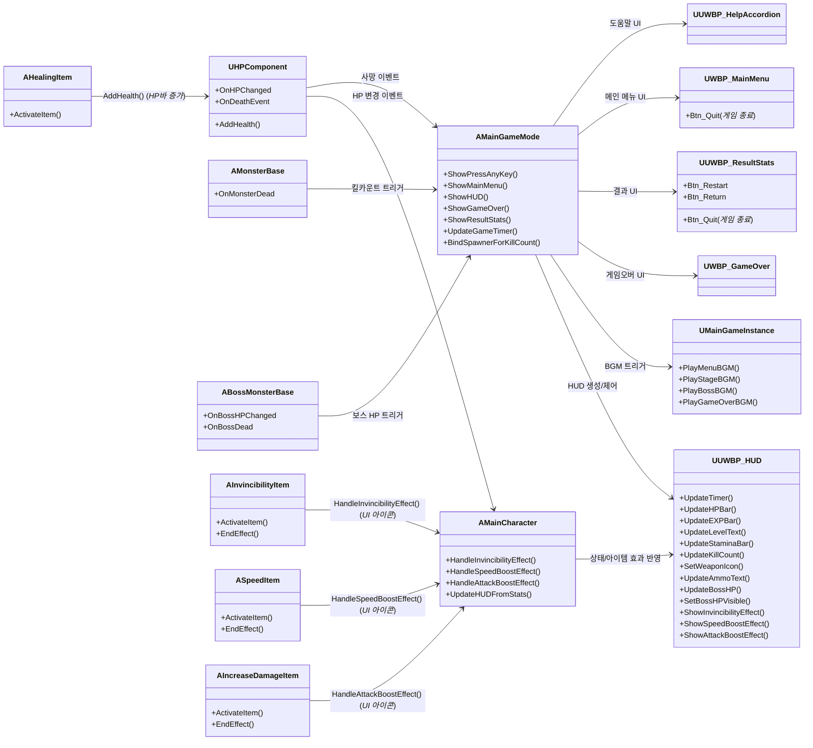

# Protocol9 프로젝트 UI 구조 (UI 관점)

## 1) 전체 흐름 요약

* **GameMode**: 화면 전환(PressAnyKey/MainMenu/HUD/GameOver/Result), 타이머, 킬카운트, 보스 HP UI를 **중앙에서 제어**
* **GameInstance**: 화면 전환 타이밍에 맞춰 **BGM 재생** 일원화
* **MainCharacter**: **HP/EXP/스태미나/레벨/무기** 상태 및 **아이템 효과를 HUD로 반영**
* **HUD 위젯**: 타이머·HP·EXP·스태미나·킬수·무기·보스HP·아이템 효과(무적/속도/공격력) **표시 담당**
* **GameOver/Result/Help 위젯**: 각 화면의 **버튼/동작 담당**
* **Monster/Boss**: 죽거나 맞으면 **GameMode로 이벤트** 전달 → **HUD 킬수/보스HP** 반영
* **아이템 → MainCharacter → HUD**:

  * 무적/속도/공격력 **버프 아이템 습득 시**, MainCharacter가 **HUD 아이콘 점등 함수**를 호출해 시각적 피드백 제공
  * 힐 아이템 습득 시 **HP 증가** → HUD HP바로 즉시 반영
* **MainMenu/ResultStats**: 각 화면에 **게임 종료 버튼**이 추가되어 플레이어가 즉시 프로그램을 종료할 수 있음

---

## 2) 클래스별 역할 요약

| 클래스                                                                      | 역할            | UI 관련 책임                                                                                            |
| ------------------------------------------------------------------------ | ------------- | --------------------------------------------------------------------------------------------------- |
| **AMainGameMode**                                                        | UI 총괄         | 화면 전환(PressAnyKey/MainMenu/HUD/GameOver/Result), HUD 생성/교체, 타이머·킬카운트·보스HP 갱신, GameInstance로 BGM 트리거 |
| **UMainGameInstance**                                                    | 오디오           | 메뉴/스테이지/보스/게임오버 BGM 재생 일원화                                                                          |
| **AMainCharacter**                                                       | 플레이어 상태 → HUD | HP/EXP/레벨/스태미나/무기/탄창 변화 시 HUD 업데이트, **아이템 효과 수신 시 HUD 아이콘 점등(무적/속도/공격력)**                           |
| **UHPComponent**                                                         | 체력            | 피해/회복/사망 이벤트 브로드캐스트 → GameMode/HUD로 전달 (힐 아이템 적용 시 HP 증가 → HUD 반영)                                  |
| **UUWBP\_HUD**                                                           | 인게임 HUD       | 타이머, HP/EXP/레벨/스태미나, 킬수, 무기/탄약, **보스HP**, **아이템 효과 아이콘**(Invincibility/Speed/Attack) 표시             |
| **UWBP\_GameOver**                                                       | 게임오버          | 승패/킬수 표시, Retry 콜백 바인딩                                                                              |
| **UUWBP\_ResultStats**                                                   | 통계            | 총 킬수/경과시간 표시, 버튼 동작 (재시작, 메뉴 복귀, **게임 종료**)                                                         |
| **UUWBP\_HelpAccordion**                                                 | 도움말           | 섹션 단일 확장/닫기, 포커스 이동                                                                                 |
| **UWBP\_MainMenu**                                                       | 메인 메뉴         | 게임 시작, 도움말, **게임 종료 버튼** 기능 제공                                                                      |
| **AMonsterBase / ABossMonsterBase**                                      | 이벤트 소스        | 사망/피격 이벤트 → GameMode → HUD의 킬수/보스HP 갱신 트리거                                                          |
| **AInvincibilityItem / ASpeedItem / AIncreaseDamageItem / AHealingItem** | 아이템           | 습득 시 MainCharacter를 통해 **HUD 아이콘 점등**(무적/속도/공격력) 또는 **HP 증가**(힐) 반영                                 |

---

## 3) Mermaid 다이어그램 (UI 흐름 + 아이템 신호 포함)



---

## 4) UI 핵심 연결 포인트

### **GameMode (AMainGameMode)**

* **화면 전환 총괄**

  * `ShowPressAnyKey / ShowMainMenu / ShowHUD / ShowGameOver / ShowResultStats`
* **HUD 관리**

  * HUD 생성 직후 캐릭터에 포인터 전달
* **게임 진행 제어**

  * 스포너/몬스터 이벤트 → 킬카운트 자동 증가
  * 타이머 관리 → HUD 반영
  * 보스 등장 시 보스 HP UI 표시·갱신
* **메뉴/결과 UI 버튼 바인딩**

  * Restart / Return /Quit 버튼 바인딩을 통해 언제든 게임 종료 가능

---

## 5) Troubleshooting 기록

### 1. HUD가 캐릭터 상태를 못 갱신하던 문제

**초기 코드 (문제점)**
HUD를 GameMode에서 생성했지만, 캐릭터가 HUD 포인터를 모르기 때문에 체력/스태미나/EXP 변화가 UI에 반영되지 않았음.

```cpp
// AMainGameMode::ShowHUD (초기 버전)
if (WBP_HUD)
{
    CurrentWidget = CreateWidget<UUserWidget>(GetWorld(), WBP_HUD);
    CurrentWidget->AddToViewport();
}
```

**해결 코드 (HUD 포인터 전달)**
HUD 생성 직후, 플레이어 캐릭터에 HUD 포인터를 알려주도록 수정.
→ 캐릭터가 직접 HUD 갱신 함수를 호출 가능해짐.

```cpp
// AMainGameMode::ShowHUD (수정 버전)
if (WBP_HUD)
{
    UUWBP_HUD* HUDWidget = CreateWidget<UUWBP_HUD>(GetWorld(), WBP_HUD);
    if (HUDWidget)
    {
        HUDWidget->AddToViewport();
        CurrentWidget = HUDWidget;

        if (AMainCharacter* MC = Cast<AMainCharacter>(UGameplayStatics::GetPlayerCharacter(this, 0)))
        {
            MC->SetHUDWidget(HUDWidget); // HUD 포인터 전달
        }
    }
}
```

---

### 2. 게임오버 → 결과창 전환이 딜레이 없이 튀던 문제

**초기 코드 (문제점)**
GameOver 후 바로 `ShowResultStats()`를 호출하니, UI가 겹치거나 너무 빨리 전환됨.

```cpp
// AMainGameMode::HandleGameOver (초기)
ShowGameOver();
ShowResultStats();  // 즉시 실행 → 겹침 발생
```

**해결 코드 (타이머 활용)**
`FTimerHandle`을 사용하여 0.1초 지연 후 결과창 표시.
→ UI 전환이 부드럽게 이어짐.

```cpp
// AMainGameMode::HandleGameOver (수정)
ShowGameOver();
GetWorldTimerManager().SetTimer(PauseTimerHandle,
    FTimerDelegate::CreateLambda([this]()
    {
        ShowResultStats();
    }), 0.1f, false);
```

---

### 3. 아이템 효과 아이콘이 UI에서 안 꺼지던 문제

**초기 코드 (문제점)**
아이템을 먹으면 HUD 아이콘이 켜지지만, 일정 시간이 지나도 꺼지지 않아 영구적으로 활성화되는 버그 발생.

```cpp
// AMainCharacter (초기)
void AMainCharacter::HandleSpeedBoostEffect()
{
    if (HUDWidget)
        HUDWidget->ShowSpeedBoostEffect(true); // 켜기만 하고 끄는 처리 없음
}
```

**해결 코드 (타이머 기반 비활성화)**
아이템 효과가 끝나는 시점에 자동으로 HUD 아이콘을 끄도록 구현.

```cpp
// AMainCharacter (수정)
void AMainCharacter::HandleSpeedBoostEffect(float Duration)
{
    if (HUDWidget)
    {
        HUDWidget->ShowSpeedBoostEffect(true);

        // 일정 시간 뒤 꺼지도록 타이머 등록
        FTimerHandle TimerHandle;
        GetWorldTimerManager().SetTimer(TimerHandle, [this]()
        {
            if (HUDWidget)
                HUDWidget->ShowSpeedBoostEffect(false);
        }, Duration, false);
    }
}
```

---


