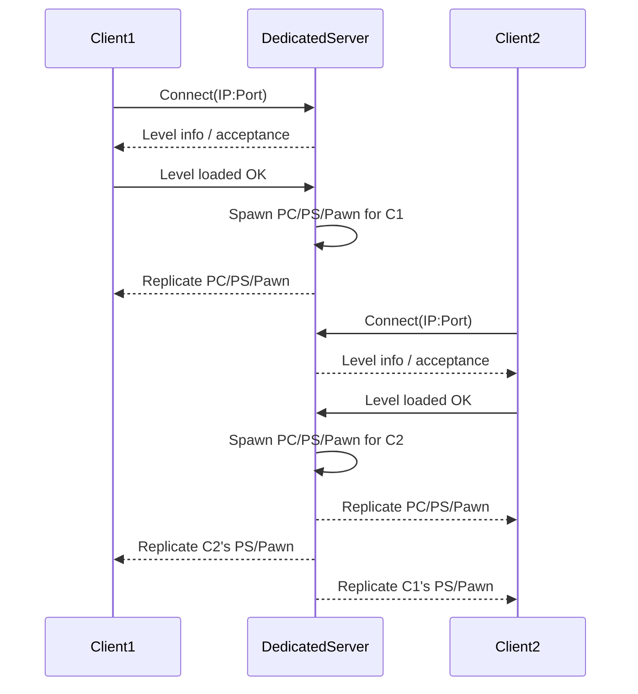
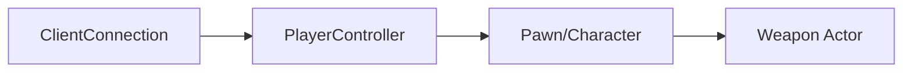

##  오늘 배운 핵심 요약

* 온라인 멀티플레이의 서버 구조는 **P2P / Listen / Dedicated**로 나뉜다.
* **Dedicated Server**는 오직 서버 역할만 수행하는 별도 프로세스(로컬 플레이어 없음). 모든 클라이언트는 서버에 접속해 **서버↔클라** 경로로만 통신한다.
* **GameMode는 서버 전용(복제 X)**, **GameState/PlayerState/Controller/Character는 복제**되어 클라에도 존재한다.
* **NetMode**(월드의 역할), **NetConnection**(연결 단위), **NetDriver**(네트워크 드라이버)가 멀티플레이의 뼈대다.
* 보안/공정성 확보를 위해 **데미지·판정 등 권위 로직은 반드시 서버에서 처리**한다.
* RPC/레플리케이션, 소유권(Ownership), 역할(Roles)은 위 개념들(NetMode/Connection/Driver)을 기초로 동작한다.

---

## 서버의 종류(개념 정리)

### 1) P2P (Peer to Peer)

* 모든 참여자가 동시에 클라이언트이자 서버 역할.
* 장점: 중앙 서버 비용↓, 지연 경로 짧을 수 있음.
* 단점: NAT/보안/치팅 관리가 어려움, 일관성 유지가 까다로움.
* 예) 토렌트, 일부 세션형 게임(다크소울의 매칭 등)

### 2) Listen Server

* \*\*Host(한 명)\*\*가 자신의 게임 프로세스로 서버+클라를 겸함, 나머지는 Guest(순수 클라).
* 장점: 서버 따로 안 띄워도 됨, 빠른 테스트/소규모 협동에 적합.
* 단점: Host가 나가면 세션 붕괴, Host의 치팅 리스크, 호스트 PC 성능/회선 의존.

### 3) Dedicated Server

* 서버만 수행하는 전용 프로세스. **그래픽/사운드/입력 제거**로 리소스 절감.
* 장점: 권위 서버 기반 보안/공정성↑, 확장/모니터링/오토스케일 용이.
* 단점: 서버 인프라 비용, 운영/배포 자동화 필요.
* 예) 배틀그라운드, 대규모 멀티 대부분

---

## Dedicated Server 실행 흐름

1. **서버 프로세스 시작**

* PIE에서 서버 다중 인스턴스, 혹은 별도 `Server.exe` 실행.
* 인자 예시: `Open <LevelName>?Listen` → 해당 맵을 열고 **외부 접속 허용**.
* `?Listen`이 없으면 싱글(StandAlone).

2. **서버 초기화**

* `WorldSettings`를 통해 **GameMode, GameState** 클래스를 확인.
* 서버는 **GameMode(서버 전용)**, \*\*GameState(복제됨)\*\*를 스폰·관리.
* GameMode는 절대 클라에 존재하지 않음(복제 X).

3. **클라이언트 접속**

* 클라는 서버 `IP:Port(기본 7777)`로 접속 요청.
* 서버는 접속 승인→필요 리소스/맵 정보를 전달.
* 클라는 동일 맵 로드 완료 후 서버에 “로딩 성공” 통지.

4. **플레이어 액터 생성/복제**

* 서버는 해당 클라 전용 **PlayerController**, **PlayerState**, **Pawn/Character**를 생성.
* 이들은 클라로 **복제(Replication)** 되어 동기화됨.
* **PlayerController**는 “자기 자신 것”만 클라에 로컬로 존재(타인의 PC는 서버에만 ‘영혼’처럼 존재).

5. **다수 클라 확장**

* 새로운 클라가 들어오면 위 과정을 반복.
* 각 클라의 PlayerState/Character는 서로에게 **복제**되어 보이게 됨.
* **클라↔클라 직접 통신은 불가**, 반드시 서버를 경유.

#### 시퀀스



---

## NetMode (월드의 역할)

* **StandAlone**: 연결 없음(싱글/로컬). 서버/클라 로직을 한 프로세스에서 적절히 수행.
* **Client**: 서버에 붙은 클라. **서버 로직 없음**(권위 없음), 복제된 프록시 표시.
* **ListenServer**: 서버 + 로컬 플레이어 존재.
* **DedicatedServer**: 서버 전용(로컬 플레이어 없음).

**왜 중요?**
같은 함수(BeginPlay/ Tick/ RPC)가 \*\*어느 측(서버/클라)\*\*에서 돌고 있는지에 따라 올바른 행위가 달라지기 때문입니다.
예: 데미지/스폰/승패 판정 등은 **서버에서만**.

> UE 내부 결정 로직(요지)
>
> * `UWorld::InternalGetNetMode()`는 **NetDriver 유무**와 `IsRunningClientOnly()`로 구분.
> * `UNetDriver::GetNetMode()`는 **IsServer()**(= ServerConnection 없음)와 `GIsClient`/PIE 플래그 등으로 Listen/Dedicated/Client를 리턴.
> * 액터의 `GetNetMode()`는 내부적으로 월드의 NetMode를 질의.

---

## NetConnection – 연결의 단위

* **서버**: 접속한 클라마다 `ClientConnections[]`를 보유/관리.
* **클라**: 서버와의 `ServerConnection` **단 하나**를 가짐.
* `PlayerController`는 자신의 **Owning Connection**을 갖는다(클라의 ‘나’를 대표).
* Pawn/무기 등은 소유 체인(Owner)을 통해 **상위의 Owning Connection**을 추적할 수 있음.
* 이 \*\*소유권(Ownership)\*\*은 RPC 허용 여부와 복제 범위를 좌우한다.

#### 소유 체인(패밀리) 개념도



---

## NetDriver – 네트워크 드라이버

* 멀티플레이에서 `UWorld::Listen()` 시 생성. 싱글(StandAlone)에서는 생성되지 않음.
* 소켓 생성/패킷 송수신/채널 관리/연결 수립/타임아웃 등 저수준 관리.
* 각 PC(서버, 각 클라)마다 **자기 NetDriver**가 존재.
* 서버 NetDriver는 `ClientConnections`를, 클라 NetDriver는 `ServerConnection` 하나를 관리.

---

## Roles, Authority, Ownership

* **Authority**: 서버에서 `HasAuthority()` 참 → 권위 있음.
* **Roles**: `GetLocalRole()` / `GetRemoteRole()`

  * 서버에서 자신의 로컬 롤은 보통 `ROLE_Authority`.
  * 클라에서 소유 Pawn은 `ROLE_AutonomousProxy`, 타인의 Pawn은 `ROLE_SimulatedProxy`.
* **RPC 권한(요지)**

  * **Server RPC**: 클라→서버 호출. **소유 클라**만 해당 액터에 Server RPC 호출 가능.
  * **Client RPC**: 서버→특정 클라 호출. 해당 액터의 **Owning Connection**으로 전달.
  * **NetMulticast RPC**: 서버→모든(또는 관련) 클라 브로드캐스트. (서버에서만 호출 권장)
* **중요**: **GameMode는 복제되지 않으므로 클라에서 접근 불가**(nullptr). 공유 상태는 GameState에 둔다.

---

## 보안/공정성 관점

* **클라에서 데미지 계산** → 패킷 조작 리스크(핵) ↑
* **서버에서 판정/계산** → 패킷에 ‘결과’가 실리지 않거나, 서버 검증으로 위변조 차단 가능
* 치팅 방어, 리플레이/로그 검증, 서버 권위 재동기화 등을 위해 **권위 서버 설계**가 표준

---

## 실전 디버깅 루틴

### 1) NetMode/Role 표기 유틸(간단 예)

```cpp
static FString NetTag(const AActor* Ctx) {
  if (!Ctx) return TEXT("None");
  const UWorld* W = Ctx->GetWorld();
  const ENetMode NM = W ? W->GetNetMode() : NM_Standalone;

  auto ModeStr = [NM] {
    switch (NM) {
      case NM_Standalone: return TEXT("Standalone");
      case NM_Client: return TEXT("Client");
      case NM_ListenServer: return TEXT("ListenServer");
      case NM_DedicatedServer: return TEXT("DedicatedServer");
      default: return TEXT("Unknown");
    }
  }();

  const auto LocalRole = Ctx->GetLocalRole();
  const auto RemoteRole = Ctx->GetRemoteRole();

  return FString::Printf(TEXT("[%s | L:%d R:%d]"), ModeStr, (int)LocalRole, (int)RemoteRole);
}
```

> 로그에 `NetTag(this)`를 붙여두면 “어디/어떤 롤”에서 실행 중인지 즉시 식별 가능.

### 2) 권위 가드 패턴

```cpp
void AMyActor::ApplyDamage_ServerAuth(float Amount)
{
  if (!HasAuthority()) return;    // 서버에서만 실행
  Health = FMath::Clamp(Health - Amount, 0.f, MaxHealth);
  OnRep_Health();                 // 클라에 갱신 표시(또는 RepNotify 활용)
}
```

### 3) 스폰/파괴는 서버에서

```cpp
void AMyGameMode::SpawnEnemy()
{
  // GameMode 자체가 서버 전용이므로 안전
  GetWorld()->SpawnActor<AEnemy>(EnemyClass, Transform);
}
```

### 4) 클라에서 GameMode 접근 금지

```cpp
if (HasAuthority()) {
  if (AGameModeBase* GM = GetWorld()->GetAuthGameMode()) {
    // 서버에서만 접근
  }
}
// 클라에서는 GameState 사용
```

---

## NetMode에 따른 액터 존재 정리

* **서버 전용**: **GameMode**
* **서버+클라**: **GameState**, Pawn/Character, 대부분의 배경 액터(복제/리레번시 설정에 따름)
* **서버+해당 클라만**: **PlayerController**(본인 것만 로컬)
* **클라 전용**: **UI** (※ **ABP는 서버·클라 모두 존재** — 잘못된 통념 주의)

---

## 체크리스트

* [ ] 지금 함수가 **서버/클라/싱글** 어디서 도는지 **NetMode**로 확인
* [ ] **GameMode=서버 전용**, **GameState=공유 상태** 설계
* [ ] **Server RPC**는 **소유 클라만 호출** 가능(Ownership 체크)
* [ ] **스폰/파괴/판정/점수** 등 권위 로직은 **서버에서만**
* [ ] **Client RPC**는 특정 **Owning Connection**을 대상으로 보냄
* [ ] **NetMulticast**는 서버에서만 호출(권장)
* [ ] **레플리케이션 조건/리레번시/도먼시**를 과도하게 막지 않았는지 점검
* [ ] 디버깅 시 **NetTag/HasAuthority/IsLocallyControlled** 등으로 호출 측 명확화

---

## 퀴즈

### Q1. Dedicated Server 구조에서 **GameMode**가 클라이언트에 존재하지 않는 이유는?

**정답/해설**: GameMode는 **권위(Authority) 로직의 총본산**이라서 **서버에만** 존재해야 일관성을 보장합니다. 클라에 있으면 서로 다른 규칙/결과가 생길 위험이 큼. 공유 상태는 \*\*GameState(복제됨)\*\*로 배포.

---

### Q2. 클라↔클라 직접 통신이 막힌 구조가 주는 보안상의 장점은?

**정답/해설**: 반드시 서버를 경유하므로 **패킷 조작/치팅 검증**이 가능해짐. 위치·데미지·점수 등의 **결정은 서버에서 계산**하고, 클라는 **표시/UI**만 담당하므로 변조 영향이 제한됨.

---

### Q3. 서버에 클라가 3명 접속했다. `UNetDriver`와 `UNetConnection`은 각각 몇 개?

**정답/해설**:

* 서버 PC: `UNetDriver` **1개**, `ClientConnections` **3개**
* 각 클라 PC: `UNetDriver` **1개**, `ServerConnection` **1개** (총 3 클라이면 클라 쪽 NetDriver도 3개, 각자 1개씩)

---

### Q4. 클라에서 `GetGameMode()`가 `nullptr`을 주는 이유와 해결책?

**정답**: GameMode는 **서버 전용**이라 클라엔 없음 → `nullptr`. 해결은 **서버에서만 접근**(`HasAuthority()` 가드)하거나, 클라에서는 **GameState**를 통해 필요한 공유 상태를 읽는다.

---

### Q5. 어떤 액터에서 **Server RPC**를 호출하려면 클라 측 전제조건은?

**정답**: 그 액터는 **해당 클라의 Owning Connection**에 속해야 한다(보통 그 클라의 PC/Pawn 계보). 소유하지 않은 액터에 대해선 Server RPC가 거부된다(로그에 “no owning connection” 계열 경고).

---

### Q6. Listen Server와 Dedicated Server의 **핵심 차이** 2가지는?

**정답**: (1) **로컬 플레이어 존재 여부**(Listen=있음 / Dedicated=없음), (2) **리소스/보안/지속성**(Dedicated는 렌더/오디오 제거로 리소스 절감 & 운영/모니터링에 유리, 권위 서버 강함. Listen은 호스트 의존/치팅 리스크↑).

---

### Q7. 데미지를 클라에서 계산하면 어떤 문제가 생기고, 서버에서 계산하면 무엇이 좋아지나?

**정답**: 클라 계산은 **패킷 변조**로 손쉽게 악용됨. 서버 계산은 \*\*검증/일관성/재현성(로그/리플레이)\*\*이 보장되고, 클라는 결과만 받아 표시하므로 보안과 공정성이 향상됨.

---

### Q8. RPC 3종(Server/Client/NetMulticast) 간 **보내는 쪽/받는 쪽** 요약?

**정답**:

* **Server RPC**: **클라→서버** (단, **소유 클라**만 가능)
* **Client RPC**: **서버→특정 클라** (해당 **Owning Connection** 대상)
* **NetMulticast RPC**: **서버→모든(또는 관련) 클라** 브로드캐스트

---


