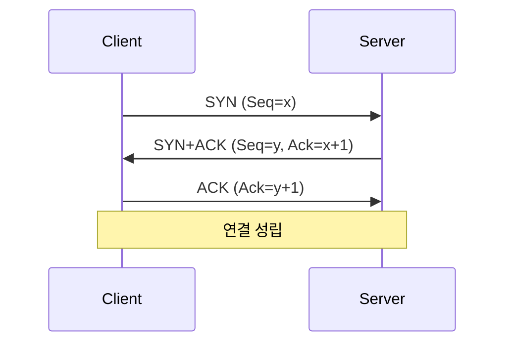
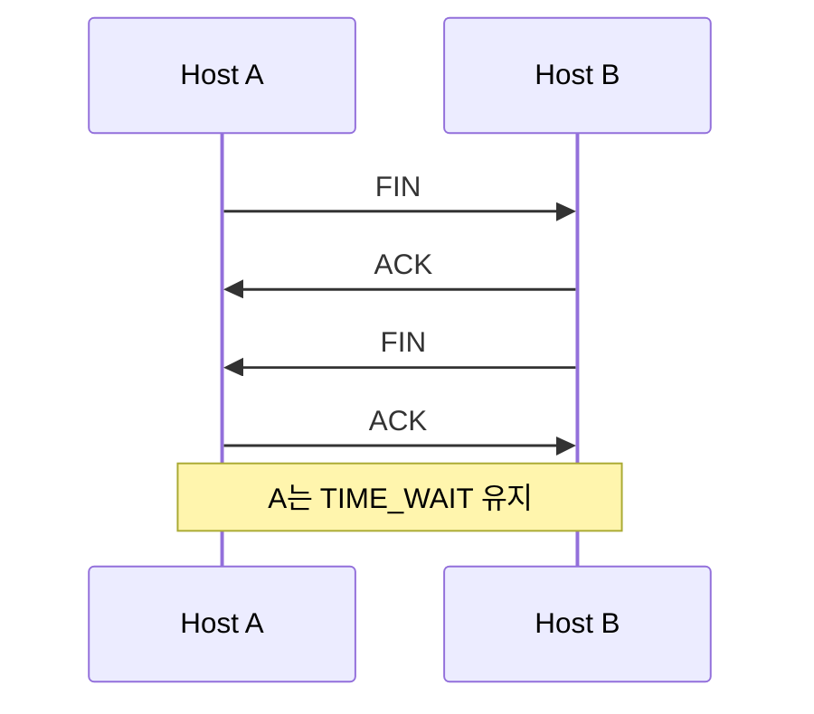

# 📘 TIL – TCP와 UDP의 구조적 차이와 동작 원리


## 🧩 철학적 차이

| 프로토콜    | 설계 철학                           | 결과                       |
| ------- | ------------------------------- | ------------------------ |
| **TCP** | 신뢰성·순서·공정성을 **프로토콜이 책임**        | 헤더/로직이 복잡 → 느리지만 안전      |
| **UDP** | 최대한 단순·빠르게, 나머지는 **애플리케이션이 처리** | 헤더가 작고 지연 없음 → 빠르지만 신뢰성↓ |

---

## 🔍 구조 비교

| 항목     | TCP                      | UDP                |
| ------ | ------------------------ | ------------------ |
| 연결 방식  | 연결지향 (3-way handshake)   | 비연결 (바로 전송)        |
| 신뢰성    | 시퀀스 번호·ACK·재전송으로 보장      | 없음                 |
| 순서 보장  | 있음                       | 없음                 |
| 흐름 제어  | 수신 윈도우(rwnd)             | 없음                 |
| 혼잡 제어  | cwnd, AIMD, Slow Start 등 | 없음                 |
| 데이터 단위 | 스트림 (바이트 흐름)             | 데이터그램 (메시지 단위)     |
| 헤더 크기  | 최소 20바이트                 | 8바이트               |
| 사용 사례  | 웹, 파일 전송, 메신저            | 실시간 게임, 스트리밍, 음성통화 |

---

## 🖼️ TCP 연결/종료 흐름

### 🔗 연결 (3-way handshake)



* SYN: 내 시퀀스 번호(ISN)를 알려줌
* ACK: 상대 시퀀스를 확인
* **양방향 상태 동기화**로 안정적인 연결 확보

---

### 🔚 종료 (4-way handshake)



* 종료도 양방향 확인 필요
* TIME\_WAIT: 지연된 패킷을 흡수하기 위해 일정 시간 대기

---

## 🖼️ 헤더 구조

### TCP 헤더

```
┌────────┬────────┬────────┬────────┐
│SrcPort │DstPort │Sequence│ACK Num │
├────────┼────────┼────────┼────────┤
│HeaderLen│Flags  │Window  │Checksum│
├────────┴────────┴────────┴────────┤
│Options ...                        │
└───────────────────────────────────┘
```

* Flags: SYN, ACK, FIN, RST, PSH, URG, ECE, CWR
* Sequence/ACK: 바이트 단위로 순서 추적
* Window: 흐름/혼잡 제어

### UDP 헤더

```
┌────────┬────────┬────────┬────────┐
│SrcPort │DstPort │Length  │Checksum│
└────────┴────────┴────────┴────────┘
```

* 단순 포트/길이/체크섬 정보만

---

## 🔄 TCP 동작 메커니즘 요약

1. **연결 설정**: 3-way handshake
2. **데이터 전송**:

   * 시퀀스/ACK 번호로 순서 보장
   * 누락 시 재전송
   * 흐름 제어(rwnd), 혼잡 제어(cwnd)
3. **종료**: 4-way handshake + TIME\_WAIT
4. **부가 기능**: SACK, 윈도우 스케일, Nagle 알고리즘 등

---

## 🔄 UDP 동작 메커니즘 요약

1. **연결 없음**: 첫 패킷부터 전송
2. **헤더 단순화**: 8바이트
3. **경계 유지**: 메시지 단위
4. **신뢰성·순서 보장 없음**: 필요 시 앱에서 직접 구현

---

## 📌 면접 꼬리질문 대비 요약

| 질문                          | 답변                                           |
| --------------------------- | -------------------------------------------- |
| 왜 TCP는 3-way handshake를 써요? | 양방향 ISN 동기화와 생존 확인. 2-way면 유령 패킷 위험.         |
| SYN/ACK의 의미는?               | SYN: 내 시작번호 알림, ACK: 상대 번호 확인.               |
| 흐름 제어 vs 혼잡 제어 차이           | 흐름 제어: 수신 버퍼 용량 기반. 혼잡 제어: 네트워크 상태 기반.       |
| 왜 TCP는 스트림 기반, UDP는 메시지 기반? | TCP는 분할·조립을 감추기 위해, UDP는 경계를 유지해 실시간성 확보.    |
| HOL 블로킹이란?                  | TCP는 누락 패킷 오기 전까지 뒤 데이터도 못 넘겨 지연.            |
| UDP로 신뢰성 구현 가능?             | 가능, 앱에서 번호, ACK/NAK, 재전송, FEC 등 직접 구현.       |
| QUIC은 왜 등장?                 | UDP 위에서 신뢰성+TLS+다중 스트림 제공, HOL 완화, 0-RTT 연결. |

---

## 🧠 한 문장 정리

> TCP는 연결·시퀀스·ACK·흐름·혼잡제어 등 **모든 안전장치를 프로토콜이 내장**해 신뢰성과 순서를 제공하지만 느리고 무겁고,
> UDP는 **이 모든 걸 생략**해 매우 가볍고 빠르지만 신뢰성은 애플리케이션 몫입니다.


