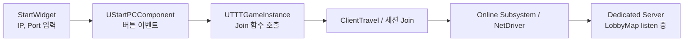

# 포트 번호를 입력받아 Join하는 네트워크 구조

## 1. 전체 구조 개요

> “클라이언트가 Start 화면에서 IP/Port를 입력 → `GameInstance`로 전달 →
> UE 네트워크 계층(Online Subsystem + NetDriver)을 통해 해당 서버로 접속”



* **UI 레벨 (StartWidget)**

  * 유저가 **서버 IP + 포트 번호**를 입력하고 `Join` 버튼 클릭
* **게임 코드 레벨 (StartPCComponent → GameInstance)**

  * 입력값을 받아서 `UTTTGameInstance`의 Join 함수 호출
* **엔진 레벨 (Online Subsystem + NetDriver)**

  * 우리가 만든 URL(또는 세션 정보)을 기반으로
    **소켓 연결 및 패킷 송수신, 복제, RPC 처리**를 담당

---

## 2. Start 화면 – IP/Port 입력 UI

### 2-1. StartWidget

* `UStartWidget` (UMG)

  * `EditableTextBox_ServerIP`
  * `EditableTextBox_Port`
  * `Host 버튼`, `Join 버튼`

* **사용자 흐름**

  1. 서버 주소: `127.0.0.1` 또는 EC2 퍼블릭 IP 입력
  2. 포트 번호: `7777` 등 입력
  3. `Join` 버튼 클릭 → 아래의 Blueprint/C++ 이벤트로 연결

### 2-2. UStartPCComponent – 버튼 이벤트 처리

* `UStartPCComponent::BeginPlay()` 에서 StartWidget 생성
* StartWidget의 `OnJoinClicked` 같은 델리게이트를
  **PlayerController Component**가 바인딩하는 구조 (프로젝트 전체 패턴과 동일)

**개념 코드 예시(발표용):**

```cpp
void UStartPCComponent::OnJoinButtonClicked(const FString& InputIP, int32 InputPort)
{
    if (UGameInstance* GI = GetWorld()->GetGameInstance())
    {
        if (UTTTGameInstance* TTTGI = Cast<UTTTGameInstance>(GI))
        {
            TTTGI->JoinByIP(InputIP, InputPort);
        }
    }
}
```

* 이 시점까지는 **온라인 서브시스템 전혀 모르게**,
  그냥 “IP/Port를 GameInstance에 넘겨주기”만 하는 단계입니다.

---

## 3. GameInstance – 네트워크 허브

### 3-1. UTTTGameInstance의 역할

* **게임 전 구간을 관통**하는 **네트워크 허브**

  * 맵이 바뀌어도 GameInstance는 살아있음
* 이 안에서:

  * **입력 받은 포트 정리** → `GetEffectivePort`
  * **HostLobby / JoinLobby / JoinByIP** 같은 진입점 제공
  * 전역적으로 써야 하는 값들(IP, Port, 선택 맵, 선택 캐릭터 등) 보관

### 3-2. 포트 안전 처리 – `GetEffectivePort`

이미 프로젝트에 있던 함수 구조:

```cpp
int32 UTTTGameInstance::GetEffectivePort(int32 InputPort) const
{
    // 음수/0 이면 기본 포트 7777 사용
    return (InputPort > 0) ? InputPort : 7777;
}
```

* 사용자가 `0`, `-1`, 공백 같은 걸 넣어도
  **항상 최소한 7777로 떨어지도록** 안전 장치
* 발표 포인트:

  * “클라이언트가 쓰레기값을 넣어도, 서버 포트는 깨지지 않게 방어 코드를 넣었습니다.”

---

## 4. Join 흐름 – IP & Port로 접속

### 4-1. Join 함수 개념

**1) 클라이언트가 입력한 값 수신**

```cpp
void UTTTGameInstance::JoinByIP(const FString& InIP, int32 InPort)
{
    const int32 PortToUse = GetEffectivePort(InPort);

    FString Address = FString::Printf(TEXT("%s:%d"), *InIP, PortToUse);

    UE_LOG(LogTTTGameInstance, Log,
        TEXT("[JoinByIP] Try join to %s"), *Address);

    // 여기에서 Online Subsystem 또는 ClientTravel 사용
}
```

**핵심 아이디어**

* **IP + Port를 문자열로 조합** → `"123.45.67.89:7777"`
* 로그로 반드시 찍어서 **에디터/패키지 환경에서 디버깅** 가능하게

---

### 4-2. Online Subsystem과 ClientTravel

여기서 선택지는 크게 두 가지입니다.

#### (A) 직접 IP로 붙는 방식 – `ClientTravel`

```cpp
if (APlayerController* PC = UGameplayStatics::GetPlayerController(this, 0))
{
    FString URL = FString::Printf(TEXT("%s:%d"), *InIP, PortToUse);

    PC->ClientTravel(URL, TRAVEL_Absolute);
}
```

* **Online Subsystem이 아래에서 NetDriver를 통해 연결**을 처리
* 우리는 단순히 “어디로 갈지(URL)”만 알려줌
* 장점:

  * 구현 간단, 디버깅도 쉬움
* 단점:

  * 세션 리스트/매칭 UI 같은 건 별도로 구현해야 함

#### (B) Online Subsystem Session을 이용한 Join

* 만약 `OnlineSubsystemNull`/`Steam`/`EOS`를 쓰고,
  `IOnlineSession::JoinSession`을 사용했다면 구조는 이렇게 설명 가능:

```cpp
IOnlineSubsystem* OSS = IOnlineSubsystem::Get();
IOnlineSessionPtr SessionInterface = OSS->GetSessionInterface();

FOnlineSessionSearchResult SearchResult = ...; // 세션 찾기
SessionInterface->JoinSession(0, SessionName, SearchResult);
// 내부적으로 URL을 만들고 ClientTravel 호출
```

* 이 경우 발표 포인트:

  * “우리는 Online Subsystem의 Session API 위에서
    ClientTravel을 자동으로 처리하게 만들 수 있다.”
* 실제 프로젝트에서는 **직접 IP/Port로 붙는 구조**에 더 가까웠으니,
  발표용으로는 **(A) 방식 설명을 메인으로**,
  (B)는 “확장 방향” 정도로 언급해도 좋습니다.

---

## 5. Host 흐름과의 연관 – 포트 일치

### 5-1. 서버 쪽 – HostLobby / Dedicated Server

두 가지 상황이 있습니다.

1. **에디터/로컬 테스트 (Listen 서버)**

   * `StartMap`에서 Host 버튼 → `UTTTGameInstance::HostLobby(Port)`
   * 내부에서:

     ```cpp
     FString URL = FString::Printf(
         TEXT("/Game/Maps/LobbyMap?listen -port=%d"),
         PortToUse
     );
     GetWorld()->ServerTravel(URL);
     ```
   * **Online Subsystem + NetDriver**가 실제 Listen 소켓을 엽니다.

2. **패키징된 Dedicated Server**

   * 서버 exe를 커맨드라인으로 실행:

     ```bash
     TenTenTownServer.exe /Game/Maps/LobbyMap?listen -port=7777
     ```
   * 이때는 Host 버튼을 안 쓰고,
     Join 쪽에서 입력한 Port만 서버와 일치하면 됩니다.

### 5-2. Join과 Host의 연결점

* **핵심 규칙:**

  * **서버가 열고 있는 포트**와
    **클라이언트 Join 포트**가 동일해야 연결 가능
* 그래서:

  * GameInstance 쪽에서 **포트 처리 로직을 한 곳에 모아둠**
    (`GetEffectivePort`, Host/Join 둘 다 사용)
* 발표 포인트:

  * “호스트/조인 경로가 달라도,
    결국 `GameInstance`에서 포트를 통일해서 관리하도록 설계했습니다.”

---

## 6. Online Subsystem 관점에서 한 장 요약

발표자료 한 슬라이드용으로 정리하면:

> **‘우리는 Online Subsystem을 직접 만지는 대신,
> 그 위에 있는 NetTravel/ClientTravel 레이어를 사용한다.’**

* **OnlineSubsystem 역할**

  * 네트워크 드라이버(NetDriver) 생성
  * 소켓(Open/Close), 채널 관리, RPC, Replication 처리
* **우리가 한 일**

  1. Start 화면에서 **IP/Port 입력 UI** 설계
  2. `UStartPCComponent`에서 포트/주소를 **UTTTGameInstance**에 전달
  3. `UTTTGameInstance`에서

     * 포트 검증 / 기본값 처리 (`GetEffectivePort`)
     * Host: `ServerTravel("/Game/Maps/LobbyMap?listen -port=XXXX")`
     * Join: `ClientTravel("IP:Port")`
  4. 그 이후의 패킷, 연결 유지, 끊김 처리 등은
     **Online Subsystem + NetDriver가 알아서 처리**

---

## 7. 발표용 정리 멘트 예시


> “저는 Online Subsystem 위에 **직접 IP/Port를 입력해서 접속하는 흐름**을 구현했습니다.
> Start 화면의 UMG에서 서버 IP와 포트 번호를 입력받고,
> 이 값을 PlayerController의 StartPCComponent를 통해 `UTTTGameInstance`로 전달합니다.
> GameInstance에서는 잘못된 입력을 방지하기 위해 `GetEffectivePort`로 포트를 정제하고,
> Host 시에는 `ServerTravel("/Game/Maps/LobbyMap?listen -port=XXXX")` 형태로 맵을 열어
> 서버 NetDriver가 해당 포트에서 대기하도록 만들었습니다.
> 클라이언트는 동일한 포트를 가진 `"IP:Port"`로 `ClientTravel`을 호출해서 합류하고,
> 그 이후의 연결 유지와 패킷 처리, 복제, RPC는 Online Subsystem과 NetDriver가 담당하는 구조입니다.
> 이렇게 해서 우리는 **온라인 서브시스템의 하위 구현을 직접 건드리지 않고**,
> 상단에서 ‘어디에 접속할지’만 결정하는 방식으로 IP/포트 기반 조인 로직을 설계했습니다.”

