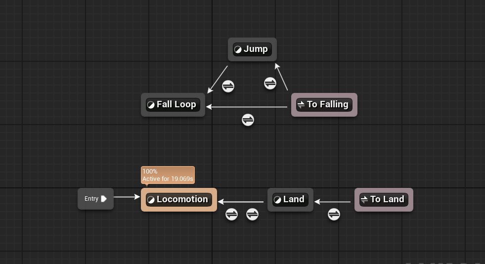

# 🎮 07.18 Unreal Engine 캐릭터 입력 & 애니메이션 학습 정리

## ✅ 학습 개요

- GameMode와 PlayerController, Character 간 흐름 정리
- Enhanced Input 시스템 설정 (IMC, IA)
- 캐릭터 이동 함수 `Move()` 구현
- 애니메이션 블루프린트 생성
- 상태머신 구성 및 전이 흐름 구현


## 1️⃣ 입력 흐름 구조

1. 사용자가 키보드 A 키 입력
2. PlayerController가 입력 인식
3. LocalPlayerSubsystem이 IMC(Input Mapping Context) 활성화
4. PlayerController → Character로 명령 전달
5. Character에서 정의한 입력 처리 함수 실행


## 2️⃣ 캐릭터 C++ 클래스 - Move 함수

```cpp
void Move(const FInputActionValue& Value);
````

* Enhanced Input 시스템에 맞춰 `FInputActionValue` 구조체를 const 참조로 처리
* 구조체 복사 비용 절감을 위한 처리 방식


## 3️⃣ 애니메이션 블루프린트 (ABP)

* `AnimInstance`를 부모로 한 애니메이션 블루프린트 생성
* 이동/점프/착지 상태를 구성하는 상태머신 작성


## 4️⃣ Event Graph - 애니메이션 변수 업데이트

* 캐릭터와 캐릭터 무브먼트를 참조해 아래 값들을 매 프레임 갱신함:

  * `GroundSpeed`
  * `ShouldMove` (속도 > 3.0 AND 가속 있음)
  * `IsFalling` (`CharacterMovement → IsFalling`)


## 5️⃣ 상태머신 구성

📌 상태 구성

* Entry → Locomotion
* Locomotion ↔ Land
* Jump → Fall Loop
* Fall Loop ↔ Jump
* **Fall Loop에서 Land로 직접 전이 없음**
* To Land 전이선은 **Jump 상태에서만 Land로 향함**





## 6️⃣ 전이 조건 예시

* Jump → Fall Loop 전이

  * `bIsFalling == true`

* Fall Loop → Jump 전이

  * `bIsFalling == false`

* Jump → Land 전이 (To Land)

  * `ShouldMove && AnimTimeRemaining < 0.1`


## 🧩 개념 정리 (당일 학습 기준)

* **GameMode**: 플레이어의 Pawn, Controller 설정 담당
* **PlayerController**: 입력 신호를 받아 Character에 전달
* **Character**: 실제 조작 객체 (Pawn 상속)
* **AnimInstance**: 애니메이션 블루프린트의 부모
* **IMC / IA**: 입력 매핑 구조 (Input Mapping Context / Input Action)
* **ABP**: 캐릭터의 애니메이션을 제어하는 블루프린트


