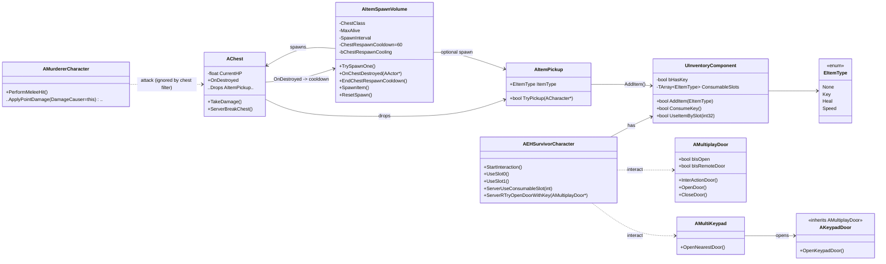

# 📄 개발 명세서 – 아이템 & 상호작용 전체 구조

## 1. 담당 범위

* 인벤토리 시스템 (`UInventoryComponent`)
* 아이템 액터 (`AItemPickup`) + 아이템 타입 (`EItemType`)
* 상자 (`AChest`) 및 스폰 볼륨 (`AItemSpawnVolume`)
* 열쇠(Key) 로직 및 문 연동 (`ConsumeKey()` → 문 열기 서버 RPC)
* 상자 파괴 후 1분 쿨다운 시스템

---

## 2. 팀과의 상호작용

* **생존자 (`AEHSurvivorCharacter`)**

  * 아이템을 습득하고 인벤토리에 보관
  * 열쇠 사용 시 감옥문(문) 열기 가능
  * 힐/스피드 아이템 사용 → 서버에서 동기화
* **문 (`AMultiplayDoor`, `AKeypadDoor`)**

  * 열쇠 사용 여부를 확인하여 개방
  * 키패드와 연동된 문(`AKeypadDoor`)은 별도 로직
* **키패드 (`AMultiKeypad`)**

  * 비밀번호/조건 충족 시 특정 문 개방
* **살인마 (`AMurdererCharacter`)**

  * 생존자에게 공격 가능
  * 상자에는 피해를 줄 수 없도록 차단

---

## 3. 전체 클래스 다이어그램

---

## 4. 동작 플로우 (시퀀스)

### 열쇠 → 문

1. 생존자 `StartInteraction()`
2. `Inventory.ConsumeKey()` 호출
3. 성공 시 `ServerRTryOpenDoorWithKey(Door)`
4. 서버에서 `Door.InterActionDoor()` 실행

### 상자 → 아이템 드롭

1. 생존자 공격 → `Chest.TakeDamage()`
2. HP 0 이하 시 `ServerBreakChest()` → `AItemPickup` 스폰
3. `OnDestroyed` → `ItemSpawnVolume.OnChestDestroyed()`
4. `bChestRespawnCooling = true` (1분)
5. 1분 후 `EndChestRespawnCooldown()` → 스폰 재개

---

## 5. 체크리스트

* [x] 열쇠는 전용 슬롯, 최대 1개만 보유
* [x] 힐/스피드 소모품은 최대 2칸 제한
* [x] 키 사용 시 서버 RPC로 문 개방
* [x] 살인마 공격은 상자에 무시됨
* [x] 상자 파괴 후 1분간 재스폰 불가

