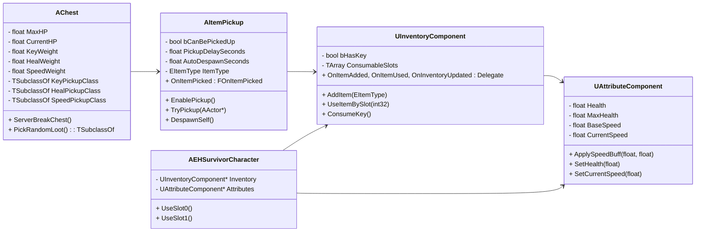

# The Eleventh Hour – 아이템 시스템 기술 명세서

*(담당자: 서호 이 / Item System & Inventory)*

---

## 1. 시스템 개요

아이템 시스템은 **멀티플레이(Authority 기반)** 를 전제로,
다음 요소를 포함한 **완전한 상호작용 루프**를 구성합니다:

> **Chest → ItemPickup → Inventory → Attribute → Character**

각 흐름은 다음과 같습니다:

1. **상자(Chest)**

   * 일정 HP를 가지며 공격 시 파괴됨.
   * 파괴 시 무작위로 아이템 드롭.

2. **아이템(Pickup)**

   * 일정 시간 후 획득 가능(`PickupDelaySeconds`).
   * 일정 시간 후 자동 소멸(`AutoDespawnSeconds`).
   * 오버랩 시 인벤토리로 전달.

3. **인벤토리(InventoryComponent)**

   * 열쇠, 회복, 스피드 아이템 관리.
   * 슬롯 2개(Heal, Speed).
   * 아이템 사용 시 `AttributeComponent`에 효과 적용.

4. **속성(AttributeComponent)**

   * 체력, 속도 등 캐릭터 상태 관리.
   * 속도 버프(`ApplySpeedBuff`), 체력 회복 로직 포함.

5. **캐릭터(EHSurvivorCharacter)**

   * 아이템 슬롯 키 입력 처리 (`1`, `2` → 슬롯 사용).
   * 힐/스피드 효과는 AttributeComponent를 통해 반영.

---

## 2. 클래스 다이어그램



---

## 3. 주요 클래스별 상세 명세

###  `AChest`

* **역할:** 아이템 드롭 상자 (파괴형 액터)
* **핵심 기능:**

  * 데미지 처리(`TakeDamage`)
  * 랜덤 아이템 드롭(`PickRandomLoot`)
  * 멀티캐스트 사운드/이펙트 처리(`MulticastPlayBreakSFX`)
  * 일정 HP 이하 시 자동 파괴 후 드롭
* **서버 전용:** 파괴 및 아이템 스폰 로직은 Authority에서만 실행됨

---

###  `AItemPickup`

* **역할:** 필드에 존재하는 획득 가능한 아이템 액터
* **핵심 기능:**

  * 일정 시간 후 획득 가능(`EnablePickup`)
  * 일정 시간 후 자동 소멸(`DespawnSelf`)
  * 오버랩 시 인벤토리 추가(`TryPickup`)
* **연동:** `UInventoryComponent`로 전달 및 획득 이벤트 발생

---

###  `UInventoryComponent`

* **역할:** 생존자 인벤토리 관리
* **핵심 데이터:**

  * `bHasKey`: 열쇠 보유 여부
  * `ConsumableSlots`: 소모 아이템(힐/스피드) 2칸
* **핵심 함수:**

  * `AddItem(EItemType)` → 아이템 추가
  * `UseItemBySlot(int32)` → 아이템 사용
  * `ConsumeKey()` → 열쇠 사용
* **버프 로직 예시:**

  ```cpp
  case EItemType::Speed:
  {
      const float AddSpeed = 200.f, Duration = 5.f;
      Attr->ApplySpeedBuff(AddSpeed, Duration);
      break;
  }
  ```
* **이벤트:**

  * `OnItemAdded`
  * `OnItemUsed`
  * `OnInventoryUpdated`
    (UI 및 HUD에 반영용 Delegate)

---

###  `UAttributeComponent`

* **역할:** 체력 및 이동속도 관리
* **핵심 함수:**

  ```cpp
  void UAttributeComponent::ApplySpeedBuff(float AddSpeed, float Duration)
  {
      SetCurrentSpeed(CurrentSpeed + AddSpeed);
      if (UWorld* World = GetWorld())
      {
          World->GetTimerManager().ClearTimer(TimerHandle_SpeedBuff);
          World->GetTimerManager().SetTimer(
              TimerHandle_SpeedBuff,
              [this](){ SetCurrentSpeed(BaseSpeed); },
              Duration, false
          );
      }
  }
  ```
* **설명:**

  * 속도 버프 적용 후 일정 시간 후 원복
  * 힐 아이템 사용 시 `SetHealth()`으로 체력 회복
  * **Authority 기반**이며 OnRep으로 클라이언트 반영

---

###  `AEHSurvivorCharacter` (당신이 작성한 부분만)

* **역할:** 플레이어 캐릭터
* **아이템 관련 기능만:**

  * `UseSlot0()` → 슬롯 0(힐) 아이템 사용
  * `UseSlot1()` → 슬롯 1(스피드) 아이템 사용
  * 인벤토리 컴포넌트 연결 (`UInventoryComponent`)
  * AttributeComponent와 연동 (`UAttributeComponent`)
* **요약:**
  아이템 사용 입력 → `InventoryComponent` → `AttributeComponent` 호출 구조

---

## 4. 데이터 흐름 요약


---

## 5. 멀티플레이 동기화 구조

| 단계            | 실행 위치   | 동기화 방식                                                 |
| ------------- | ------- | ------------------------------------------------------ |
| Chest 파괴/드롭   | 서버      | Multicast SFX + SpawnActor                             |
| ItemPickup 획득 | 서버      | Destroy() 후 OnItemPicked Delegate                      |
| Inventory 변경  | 서버 → 클라 | RepNotify (`OnRep_ConsumableSlots`)                    |
| Attribute 변경  | 서버 → 클라 | ReplicatedUsing (`OnRep_CurrentSpeed`, `OnRep_Health`) |
| UI 반영         | 클라이언트   | Delegate 수신 후 위젯 갱신                                    |

---

## 6. 최종 요약

| 구분   | 클래스                    | 역할                | 주요 통신                        |
| ---- | ---------------------- | ----------------- | ---------------------------- |
| 액터   | `AChest`               | 파괴형 상자, 아이템 드롭    | Server + Multicast           |
| 액터   | `AItemPickup`          | 획득 가능한 아이템        | Overlap, Destroy             |
| 컴포넌트 | `UInventoryComponent`  | 아이템 보유/사용         | Server/RepNotify             |
| 컴포넌트 | `UAttributeComponent`  | 체력/속도 등 스탯 관리     | Server/RepNotify             |
| 캐릭터  | `AEHSurvivorCharacter` | 인벤토리·속성 통합, 입력 처리 | Client Input → Server Action |

---