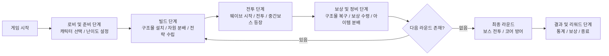
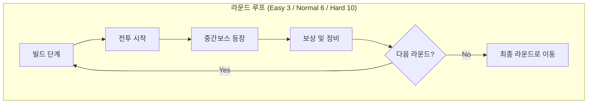

# 협력 타워 디펜스 (8인 기준)

> 1~8인이 함께 방어선을 구축하고 코어를 지키는 멀티플레이 협력형 타워 디펜스 게임
> Unreal Engine 5 + GAS + 전용 서버 기반

---

## 1. 게임 개요

| 구분     | 내용                                   |
| ------ | ------------------------------------ |
| 장르     | 협동형 타워 디펜스 (Co-op Defense / 1~8인 지원) |
| 플랫폼    | PC / Unreal Engine 5                 |
| 플레이 방식 | 라운드(웨이브)별 방어, 구조물 설치 및 캐릭터 협동 전투     |
| 목표     | 모든 라운드를 생존하고, 코어를 방어하여 최종 보스를 처치     |

---

## 2. 캐릭터 (총 8종)

역할 분담형 캐릭터 구성:
전방 탱커 2, 광역 딜러 2, 힐러 2, 원거리 딜러 2
(각 캐릭터는 능력치 + 액티브 스킬 3 + 패시브 1 구성)

| 구분       | 캐릭터                    | 역할 / 특징                                |
| -------- | ---------------------- | -------------------------------------- |
| 전방 탱커 1  | 가디언 (Guardian)         | 방패 돌진 / 방벽 전개 / 도발의 외침 – 코어 근처 방어 강화   |
| 전방 탱커 2  | 아이언램 (Iron Ram)        | 충격파 / 수호깃발 / 강인함 – 체력 30% 이하 시 피해 감소   |
| 광역 딜러 1  | 엘리멘탈리스트 (Elementalist) | 화염장 / 서리구슬 / 연쇄번개 – 상태 이상 적에게 추가 피해    |
| 광역 딜러 2  | 디몰리셔 (Demolisher)      | 폭압유탄 / 점착 폭약 / 진동 수류탄 – 폭발 피해 중심       |
| 힐러 1     | 메딕 (Medic)             | 치유빔 / 광역응급 / 과다수혈 – 짧은 버스트 힐링          |
| 힐러 2     | 드루이드 (Druid)           | 재생의 씨앗 / 수호뿌리 / 자연의 호흡 – 지속 회복 + 환경 회복 |
| 원거리 딜러 1 | 마크스맨 (Marksman)        | 관통 사격 / 회피 / 과충전 탄환 – 치명타 중심 단일 화력     |
| 원거리 딜러 2 | 스나이퍼 (Sharpshooter)    | 약점 표식 / 저격 / 섬광탄 – 비행형 몬스터 카운터         |

---

## 3. 공용 구조물

팀 전체가 설치 가능한 방어 및 공격 구조물 시스템

| 종류                      | 설명                    | 업그레이드 단계           |
| ----------------------- | --------------------- | ------------------ |
| 방어벽 (Barricade)         | 경로 유도, 코어 방어용 구조물     | 내구도 증가 / 반사피해 추가   |
| 공격 타워 (Physical Tower)  | 단일 고속 사격, 관통 업그레이드 가능 | 공격력 / 사거리 / 관통 분기  |
| 원소 타워 (Elemental Tower) | 광역 속성 공격(화염·빙결·번개)    | 속성 전환 및 확산 강화      |
| 트랩 (Trap)               | 폭발형 / 전기형 / 감속형 선택 설치 | 피해량 / 범위 / 효과 지속시간 |
| 버프 토템 (Buff Totem)      | 타워 공격속도·사거리 버프        | 지속시간 / 범위 / 강화효율   |

**한도 (8인 기준)**

* 타워 18 / 트랩 18 / 벽 28 / 토템 3
* 개인당 설치 제한: 타워 3, 트랩 3
* 업그레이드: 3단계 분기식

---

## 4. 아이템 및 인벤토리

### 주요 아이템

| 아이템                | 설명                        |
| ------------------ | ------------------------- |
| 힐팩 (Healing Kit)   | 즉시 또는 지속 회복               |
| 배터리 (Battery)      | 스킬 쿨다운 단축 또는 궁극기 게이지 +20% |
| 수리 키트 (Repair Kit) | 구조물 내구도 즉시 회복             |
| 재화 (Resource)      | 구조물 설치 및 업그레이드 비용으로 사용    |

### 인벤토리 시스템

* 개인용 인벤토리 (6칸): 소모품 4칸 + 특수 2칸 (스택 최대 5개)
* 팀 공용 창고 (12칸): 모든 팀원이 공유, 드랍 시 “선택/분배” UI 표시

---

## 5. 미니맵 및 맵 구성

### 미니맵 기능

* 팀원 위치 및 닉네임 표시
* 코어 / 구조물 / 적 위치 확인
* 핑 시스템: 위험 / 수리 / 집결 / 배치요청
* 최근 5개 핑 강조 표시

### 맵 종류 (2~3개)

1. 메사 캐년 – 2레인 합류형, 벽 유도 전략형
2. 폐허 도시 – 우회로 다수, 비행형 경로 존재
3. 빙설 협곡 – 회전형 경로, 이동속도 변화 지형

---

## 6. 라운드 및 난이도 구조

| 난이도    | 플레이 인원 | 라운드 수 | 보스 출현              |
| ------ | ------ | ----- | ------------------ |
| Easy   | 1~3인   | 3라운드  | 각 라운드 중간보스 + 최종 보스 |
| Normal | 4~5인   | 6라운드  | 각 라운드 중간보스 + 최종 보스 |
| Hard   | 6~8인   | 10라운드 | 각 라운드 중간보스 + 최종 보스 |

**웨이브 흐름**
준비(30~45초) → 전투(90~150초) → 중간보스 → 보상 → 다음 라운드

---

## 7. 몬스터 구성

| 종류                | 설명                   |
| ----------------- | -------------------- |
| 일반형 (Grunt)       | 근접 공격, 기본 몹          |
| 원거리형 (Ranger)     | 투사체 공격, 체력 낮음        |
| 비행형 (Flyer)       | 벽 무시, 전용 대공타워 필요     |
| 탱커형 (Tank)        | 벽 파괴, 체력 높음, 느림      |
| 서포터 (Shaman)      | 힐/버프 지원형             |
| 쉴더 (Shielder)     | 방어막 생성, 관통/번개에 약함    |
| 중간 보스 (Mini-Boss) | 라운드 종료 시 등장, 패턴 1~2개 |
| 보스 (Boss)         | 최종 라운드, 광역 및 다단계 패턴  |

---

## 8. GAS (Gameplay Ability System)

| 구성요소       | 설명                                                                          |
| ---------- | --------------------------------------------------------------------------- |
| Attributes | Health, Armor, AttackPower, SkillPower, MoveSpeed, BuildSpeed, ResourceFind |
| Tags       | State.Stunned, Damage.Fire/Ice/Lightning, Ability.Build.Place 등             |
| Abilities  | 스킬·설치·수리 모두 Ability화 (비용·쿨·예측 처리)                                           |
| 중첩 제한      | 같은 카테고리 버프는 최댓값 1개만 유지 (CC는 점감 적용)                                          |

---

## 9. 데이터 관리

| DataTable            | 역할                            |
| -------------------- | ----------------------------- |
| DT_EnemyWaves        | 라운드별 몬스터 구성, 보스 여부            |
| DT_TowerStats        | 타워 수치, 비용, 사거리, 효과            |
| DT_Items             | 아이템 효과, 쿨타임, 희귀도              |
| DT_DifficultyScaling | 난이도별 인원 계수 (Easy/Normal/Hard) |

---

## 10. UI / UX

* HUD: 코어 HP, 라운드 타이머, 팀 골드, 구조물 수, 인벤토리, 미니맵
* 설치 UI: 배치 고스트, 사거리 표시, 배치 제한 알림
* 팀 투표 시스템: 설치 한도 초과 시 교체 구조물 투표
* 미니맵 핑: 즉시 반응 및 로그 기록

---

## 11. 개발 팀 구성 (8인 균등 분배)

| 번호    | 담당 분야                           | 주요 책임                                     | 기술 중심                                                     | 세부 구현 범위                                                                                                                                                                                 |
| ----- | ------------------------------- | ----------------------------------------- | --------------------------------------------------------- | ---------------------------------------------------------------------------------------------------------------------------------------------------------------------------------------- |
| **1** | **플레이어 시스템 & 캐릭터 클래스 (GAS 기반)** | 캐릭터 이동, 공격, 스킬, 스탯(Attributes), GAS 구조 설계 | **GAS / Ability / Input / Replication**                   | - 8개 캐릭터 구현 (Guardian / IronRam / Elementalist / Demolisher / Medic / Druid / Marksman / Sharpshooter) - 기본 능력치 + 스킬 3 + 패시브 1 - 스킬 쿨타임 및 에너지 시스템 구현 - 스킬 이펙트 호출 및 OnRep 상태 동기화 |
| **2** | **빌드 시스템 & 구조물 (타워, 트랩, 벽)**    | 구조물 설치, 업그레이드, 수리, 파괴                     | **Actor / RPC / Component / Prediction**                  | - `APlaceableBase`, `IBuildable` 인터페이스 설계 - 타워, 트랩, 벽, 버프 토템 등 총 6종 구조물 구현 - 설치 제한 시스템(팀 전체/개인 한도) - 서버 권한 처리 및 설치 예측 시스템 구축                                                    |
| **3** | **AI & 웨이브 매니저**                | 몬스터 생성, 경로 탐색, 목표 선택, AI 행동 트리            | **AIController / BehaviorTree / EQS / DataTable**         | - 웨이브 스폰 매니저 (Easy 3 / Normal 6 / Hard 10 라운드) - 동적 장애물 인식(벽/타워 파괴 판단) - 중간보스·보스 패턴 AI 설계 - 난이도 및 인원 수 기반 스케일링 반영                                                               |
| **4** | **네트워크 & 게임플로우 (서버/클라이언트 구조)**  | 세션 관리, 로비, 라운드 진행, 결과 동기화                 | **Dedicated Server / GameMode / GameState / PlayerState** | - 로비 및 인원 기반 난이도 설정 시스템 - GameMode에서 라운드/보스/보상 제어 - 팀 점수 및 코어 HP 동기화 - 서버-클라이언트 RPC 및 상태 복제 관리                                                                                  |
| **5** | **UI/UX & HUD 시스템**             | HUD, 인벤토리, 빌드 UI, 미니맵, 핑, 클래스 스킬 UI       | **UMG / C++ Widget / BindWidget / Animation**             | - 메인 HUD (코어HP, 타이머, 골드, 구조물 수 등) - 인벤토리 및 팀 창고 UI - 미니맵 및 핑 시스템 구현 - 빌드 프리뷰 UI 및 설치 투표창 제작                                                                                     |
| **6** | **아이템 & 인벤토리 시스템**              | 소모품, 특수아이템, 드랍/획득/사용/공유                   | **Actor / Component / Delegate / DataTable**              | - 핵심 아이템(힐, 배터리, 수리, 재화) 구현 - 팀 공유 창고 시스템 구축 - 아이템 사용 시 GAS 연동(버프/이펙트 적용) - 획득/소모 이벤트 및 UI 연계 처리                                                                                |
| **7** | **맵/레벨디자인 & 환경 인터랙션**           | 맵 설계, 스폰 포인트, 네비게이션, 환경효과                 | **LevelDesign / NavMesh / Trigger / Blueprint**           | - 3개 맵 제작 (메사 캐년 / 폐허 도시 / 빙설 협곡) - 스폰 경로 및 우회로 배치 설계 - 환경형 함정, 지형 버프 적용 - NavMesh 경로비용(PathCost) 조정                                                                            |
| **8** | **사운드 & 이펙트 / 최적화 & QA**        | 효과음, 파티클, 성능 최적화, 밸런스 테스트                 | **Niagara / SoundCue / Profiling / QA Script**            | - 캐릭터 및 타워 공격·피격 FX 제작 - 웨이브 시작/보스 등장 사운드 구성 - Niagara GPU 파티클 최적화 - 성능 프로파일링 및 QA 자동화 테스트 구축                                                                                   |

---

## 12. 게임 플로우 (Game Flow)

### 1) 전체 진행 흐름 다이어그램

---

### 2) 단계별 상세 설명

| 단계    | 이름                            | 주요 내용                                                                                                       | 시스템 / 연동 요소                                         |
| ----- | ----------------------------- | ----------------------------------------------------------------------------------------------------------- | --------------------------------------------------- |
| **1** | **로비 및 준비 단계**                | - 인원(1~8명)에 따라 자동 난이도 설정 - 캐릭터 클래스 및 아이템 세팅 - Ready 체크 후 서버 세션 생성                                     | GameMode / PlayerState / Lobby UI                   |
| **2** | **빌드 단계 (Preparation Phase)** | - 제한 시간(30~45초) 동안 구조물 설치, 업그레이드 가능 - 자원(재화) 분배 및 팀 아이템 공유 - 미니맵 핑으로 전략 공유                            | Build System / Inventory / MiniMap / TeamStorage    |
| **3** | **전투 단계 (Combat Phase)**      | - 웨이브 몬스터 스폰 시작 - 각 클래스별 역할 수행 (탱커 방어, 딜러 지원, 힐러 회복) - 구조물 자동 공격 + 플레이어 전투 병행 - 중간보스 등장 시 강제 전투 구간 | AI WaveManager / GAS / Tower System / Combat System |
| **4** | **보상 및 정비 단계**                | - 라운드 종료 후 일정 시간 정비 구간 - 파괴된 구조물 복구 / 업그레이드 - 보상 수령 (아이템·재화) - 팀 창고에서 아이템 재분배                      | Inventory / ItemSystem / UI HUD / GameState         |
| **5** | **최종 라운드 (Final Round)**      | - 최종 보스 등장 (다단계 패턴, 전역 공격 포함) - 코어 방어 성공 시 클리어 - 실패 시 코어 붕괴 이벤트 발생                                    | Boss AI / GameMode / FX / Sound System              |
| **6** | **결과 및 리워드 단계**               | - 전투 통계 표시 (딜량, 회복량, 설치 수 등) - 난이도/인원 기반 점수 계산 및 보상 지급 - 메달/스킨/코어 조각 등 리워드 획득                         | Result UI / DataTable / SaveSystem / RewardManager  |

---

### 3) 웨이브 반복 구조 (내부 루프)

---

### 4) 핵심 흐름 요약

| 구분           | 내용                                    |
| ------------ | ------------------------------------- |
| **전체 구조**    | 로비 → 빌드 → 전투 → 정비 → (반복) → 최종 보스 → 결과 |
| **라운드 수**    | Easy 3 / Normal 6 / Hard 10           |
| **라운드 반복**   | 매 라운드마다 빌드–전투–보상 순환                   |
| **보스 등장 시점** | 각 라운드 마지막에 중간보스, 최종 라운드에 보스           |
| **클리어 조건**   | 코어 생존 + 모든 웨이브 방어 완료                  |
| **실패 조건**    | 코어 HP 0 (즉시 게임 종료)                    |

---
## 13. 개발 일정 (10주)

| 주차     | 목표                               |
| ------ | -------------------------------- |
| 1–2주차  | 코어 루프, 캐릭터 4종, 타워 2종, 기본 웨이브     |
| 3–5주차  | 캐릭터 8종 완성, 구조물·트랩 추가, 인벤토리·UI 구축 |
| 6–8주차  | 웨이브 10단계 완성, 보스 구현, 밸런스 1차       |
| 9–10주차 | 네트워크 최적화, QA, 발표용 빌드             |
---