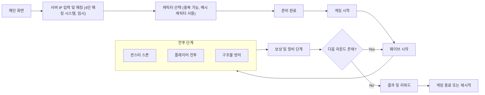

# 협력 타워 디펜스 (4인 기준)

> 1~4인이 함께 방어선을 구축하고 코어를 지키는 멀티플레이 협력형 타워 디펜스 게임
> Unreal Engine 5 + 전용 서버 기반
> IDE: Rider 사용 권장

---

## 1. 게임 개요

| 구분     | 내용                                    |
| ------ | ------------------------------------- |
| 장르     | 협동형 타워 디펜스 (Co-op Defense / 1~4인 지원)  |
| 플랫폼    | PC / Unreal Engine 5                  |
| 플레이 방식 | 라운드(웨이브)별 방어, 구조물 설치 및 캐릭터 협동 전투      |
| 목표     | 코어 건물이 파괴되면 즉시 게임오버. 모든 라운드를 생존 시 클리어 |

---

## 2. 캐릭터 (총 4종, 예시)

* 4종 캐릭터 중 중복 선택 가능
* 체력과 쿨타임 기반 스킬 보유 (마나 없음)
* 사망 시 리스폰 대기시간 후 재등장
* 캐릭터 예시는 아래와 같음

| 캐릭터               | 역할 / 특징                     |
| ----------------- | --------------------------- |
| 가디언 (Guardian)    | 방패 돌진 / 방벽 전개 / 도발 – 근접 방어형 |
| 디몰리셔 (Demolisher) | 폭발형 공격 / 벽 파괴 / 제압 중심       |
| 메딕 (Medic)        | 치유빔 / 회복 구역 생성 / 버스트 힐      |
| 마크스맨 (Marksman)   | 단일 원거리 공격 / 치명타 기반          |

---

## 3. 구조물 (예시)

| 종류                 | 설명                      | 업그레이드 단계          |
| ------------------ | ----------------------- | ----------------- |
| 방어벽 (Barricade)    | 경로 유도, 코어 방어용           | 내구도 강화 / 반사피해 추가  |
| 공격 타워 (Tower)      | 자동 사격, 관통 및 속도 업그레이드 가능 | 공격력 / 사거리 / 속도 강화 |
| 트랩 (Trap)          | 폭발형 / 감속형 등 일회용 방어 장치   | 피해량 / 범위 / 지속시간   |
| 버프 토템 (Buff Totem) | 범위 내 아군 강화              | 범위 / 지속시간 / 강화효율  |

* 한도 (4인 기준): 타워 10 / 트랩 10 / 벽 15 / 토템 2
* 개인당 설치 제한: 타워 2, 트랩 2
* 업그레이드 3단계 분기식 유지
* 구조물은 1~0번의 키로 설치 가능

---

## 4. 아이템 시스템 (예시)

* 아이템은 현재 보유한 종류 중 사용 가능한 항목만 표시됨
* 전용 키를 눌러 **아이템 UI**를 열고, 현재 사용 가능한 아이템 목록을 표시
* 앞/뒤 이동 키로 선택 후 사용 가능
* 아이템 예시는 아래와 같음

| 아이템                 | 설명                 |
| ------------------- | ------------------ |
| 힐팩 (Healing Kit)    | 일정량 회복 또는 지속 치유    |
| 수리 키트 (Repair Kit)  | 구조물 내구도 회복         |
| 버프 포션 (Buff Potion) | 일정 시간 공격력 상승       |
| 재화 (Resource)       | 구조물 설치 및 업그레이드에 사용 |

---

## 5. 상점 및 인벤토리

| 구분   | 내용                                 |
| ---- | ---------------------------------- |
| 재화   | 몬스터 처치 및 라운드 보상으로 획득               |
| 인벤토리 | 퀵슬롯 형식 (1~0 키), 슬롯별 아이템 표시         |
| 상점   | P 키로 오픈, 라운드 중에는 이용 불가 (정비 구간만 가능) |

---

## 6. 미니맵 및 UI

* 팀원, 적, 구조물 위치 표시
* 핑 시스템: 위험 / 수리요청 / 집결 / 배치요청 등
* 남은 몬스터 수, 라운드 시간 표시
* HUD: HP, 재화, 구조물 수, 타이머, 인벤토리, 미니맵 포함

---

## 7. 맵 구성

* 3레인 프로토타입 맵 (좌·중·우)
* 중세 판타지 + 캐주얼 폴리곤 스타일

---

## 8. 게임 플로우

---

## 9. 라운드 및 난이도 구조

| 난이도    | 라운드 수 | 보스 출현       | 비고    |
| ------ | ----- | ----------- | ----- |
| Easy   | 3라운드  | 중간보스 + 최종보스 | 입문용   |
| Normal | 6라운드  | 각 라운드 중간보스  | 기본 모드 |
| Hard   | 10라운드 | 중간보스 + 최종보스 | 협동 중심 |

웨이브 루프
→ 준비 (30초) → 전투 (90초) → 보상 (재화 및 아이템) → 다음 라운드

---

## 10. 팀 구성

| 파트          | 담당자      | 역할                    |
| ----------- | -------- | --------------------- |
| 캐릭터         | 정윤호, 이정민 | 캐릭터 구현 및 밸런스          |
| 몬스터(AI)     | 김동권, 박진권 | 웨이브 AI 및 경로 탐색        |
| 맵디자인        | 황순호      | 맵 설계, 스폰 경로 제작        |
| 구조물 + 아이템   | 김선우      | 설치 시스템 및 아이템 로직       |
| 네트워크 + 게임모드 | 이서호      | 세션, 라운드, 서버 흐름 제어     |
| UI + 인벤토리   | 심효종      | HUD, 상점, 인벤토리, 미니맵, 핑 |

---

## 11. 게임 단계별 흐름

| 단계 | 이름       | 주요 내용                              | 시스템 연동                         |
| -- | -------- | ---------------------------------- | ------------------------------ |
| 1  | 로비 및 준비  | 서버 IP 입력, 4인 매칭(임시), 캐릭터 선택, Ready | GameMode / Lobby UI            |
| 2  | 빌드 단계    | 제한 시간 내 구조물 설치 / 자원 분배             | Build System / Inventory       |
| 3  | 전투 단계    | 웨이브 시작, 몬스터 전투, 코어 방어              | AI WaveManager / Combat System |
| 4  | 보상 및 정비  | 구조물 복구, 재화 분배, 상점 이용               | Inventory / UI HUD             |
| 5  | 최종 라운드   | 보스 전투, 클리어/실패 판정                   | Boss AI / GameMode             |
| 6  | 결과 및 리워드 | 통계, MVP, 보상 지급                     | Result UI / DataTable          |

---

## 12. 개발 일정 (10주 계획)

| 주차    | 목표                        |
| ----- | ------------------------- |
| 1–2주차 | 기본 코어 루프, 캐릭터 2종, 웨이브 테스트 |
| 3–4주차 | 캐릭터 4종 완성, 구조물 4종 구축      |
| 5–6주차 | 인벤토리, 상점, 미니맵, UI 완성      |
| 7–8주차 | 보스 및 난이도 스케일링, 밸런스 조정     |
| 9주차   | 네트워크 안정화 및 최적화            |
| 10주차  | QA / 버그 픽스 / 발표용 빌드       |

---
