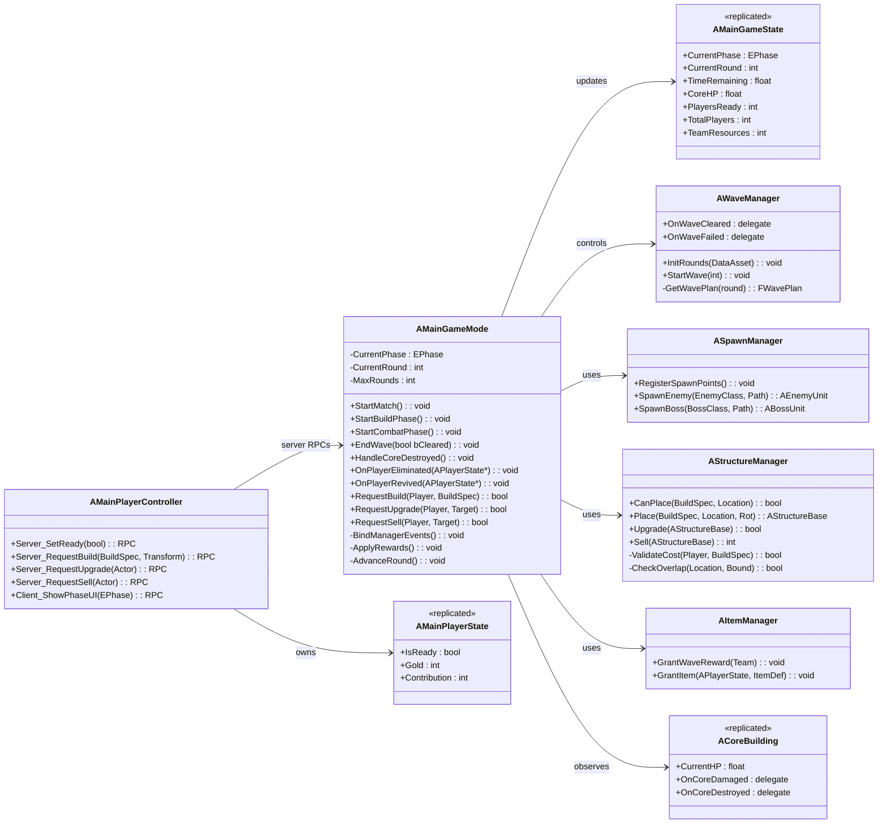
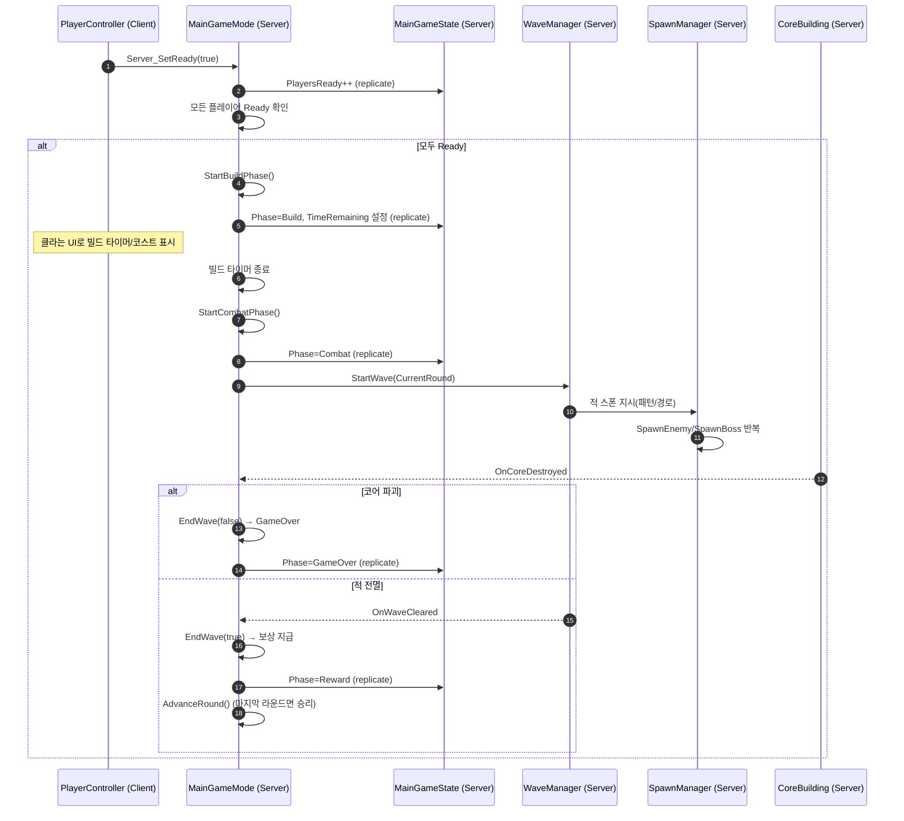
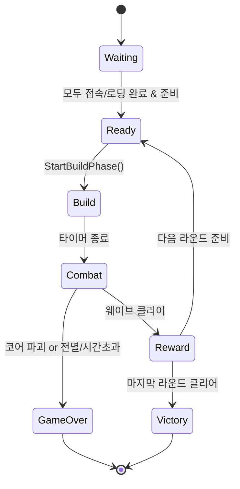

# TenTenTown – GameMode & Server Class Design (초안)

> 범위: **서버 권한(Authority) 관점의 GameMode/Server 측 클래스 설계**. 1~4인 협력형 타워 디펜스, 라운드(웨이브) 기반 진행을 전제로 한 초안입니다.
> 네트워크: Listen/Dedicated Server 모두 고려. 기본 원칙은 **서버 권한 → 상태 복제 → 클라이언트 UI 반영**.

---

## 게임 규칙 (서버 기준)

* **플레이어 수**: 1~4인 동시 플레이. 세션/매칭 여부는 외부 시스템에서 결정하며, GameMode는 시작 조건(최소 인원/준비 상태)만 확인.
* **라운드(웨이브)**: 난이도별 기본 라운드 수는 예시로 Easy 3 / Normal 6 / Hard 10. 실제 값은 `WavePlan DataAsset`으로 구성 가능.
* **페이즈**: Waiting → Ready → Build → Combat → Reward → (Victory|GameOver). 페이즈 전환/타이머는 서버가 결정하고 `GameState`로 복제.
* **승리 조건**: 마지막 웨이브 클리어 시 Victory.
* **패배 조건**: 코어 건물 HP ≤ 0 시 즉시 GameOver. (추가 조건: 모든 플레이어 전투불능/이탈과 같은 이벤트가 외부 시스템에서 전달될 경우, 정책에 따라 GameOver 처리 가능.)
* **코어(핵심 오브젝트)**: 서버 소유, 피해/파괴 이벤트 발생 시 GameMode로 통지. HP/쉴드 등 상태는 복제되어 UI에서 참조.
* **팀 자원(골드/재료)**: 서버가 소유/검증하며 웨이브 보상, 목표 달성, 적 처치 등에 따라 증가. 값은 `GameState` 또는 공유 모듈에서 복제해 UI 반영.
* **구조물(타워/트랩/배리케이드)**: 배치/업그레이드/판매 요청은 서버 RPC로 접수 → 비용/겹침/제한 검증 후 승인. 단축키/UI 구성은 외부 시스템에서 구현.
* **적/보스 스폰**: 웨이브 스크립트에 따라 서버에서 스폰 매니저가 수행. 적 AI/행동은 외부 시스템 구현, GameMode는 웨이브 진행/종료만 판정.
* **아이템/보상**: 웨이브 보상(팀/개인) 부여는 서버에서 확정. 아이템 사용/효과는 외부 시스템 구현, 결과 요약값만 GameMode가 참조.

---

## 1) 핵심 서버 엔티티 개요

* **AMainGameMode** (서버 전용)

  * 매치 상태 관리(대기 → 준비 → 빌드 → 전투 → 보상/정비 → 다음 웨이브/종료)
  * 웨이브 시작/종료 트리거, 승리/패배 판정
  * 매니저(스폰/웨이브/구조물/아이템/AI)들과 협력
* **AMainGameState** (복제됨)

  * 현재 라운드, 남은 시간, 코어 HP, 플레이어 준비 현황 등 **게임 전체 상태**를 복제
  * UI가 참조하는 공개 상태의 중심
* **AMainPlayerState** (복제됨)

  * 골드/재료, 빌드 권한, 개인 K/D/A, 기여도, 준비 여부(Ready)
* **AMainPlayerController**

  * 클라 입력 → 서버 RPC 전달(빌드/업그레이드/아이템 사용 요청, 준비 상태 토글 등)
* **AWaveManager** (서버 Only, Actor)

  * 웨이브 스크립트(라운드 난이도, 스폰 패턴, 보스 타이밍) 구동
* **ASpawnManager** (서버 Only, Actor)

  * 스폰 포인트/경로 관리, 적/보스 스폰 실행
* **AStructureManager** (서버 Only, Actor)

  * 타워/트랩/배리케이드 **배치/업그레이드/판매/수리** 처리, 비용 검증, 충돌/점유 체크
* **AItemManager** (서버 Only, Actor)

  * 드롭/상점/보상 아이템 지급, 인벤토리 서버처리 훅(필요 시)
* **ACoreBuilding** (복제됨)

  * 게임오버 조건의 핵심 오브젝트. HP/쉴드 등 상태 복제, 피해 수신 시 GameMode에 이벤트 알림
* **AEnemyUnit / ABossUnit** (AI, 복제)

  * 서버 AI 제어, 경로 추종, 코어 공격. 주요 상태(HP, CC 등) 복제

---

## 2) 클래스 다이어그램 (서버 중심)

> 외부 시스템(캐릭터/몬스터/아이템/AI 등) 내부 로직은 별도 모듈에서 구현하며, 본 문서에는 **GameMode–매니저–상태 오브젝트**와 이들과의 연동 인터페이스만 포함합니다.

> **EPhase (예시)**: Waiting, Ready, Build, Combat, Reward, GameOver

---

## 3) 서버 흐름 시퀀스 (웨이브 진행)

---

## 4) AMainGameMode 세부 설계

**책임(Responsibilities)**

* 매치/라운드/페이즈 상태 머신 운영
* 코어/웨이브/스폰/구조물/아이템 매니저와의 이벤트 연동
* 승패 판정 및 보상, 라운드 전환

**중요 함수 (예시 시그니처)**

* `virtual void StartPlay() override;` (매니저 검색/바인딩)
* `void StartBuildPhase();`
* `void StartCombatPhase();`
* `void EndWave(bool bCleared);`
* `void HandleCoreDestroyed();`
* 빌드 관련 서버 엔드포인트:

  * `bool RequestBuild(AController* By, const FBuildSpec& Spec, const FTransform& T);`
  * `bool RequestUpgrade(AController* By, AStructureBase* Target);`
  * `bool RequestSell(AController* By, AStructureBase* Target);`

**이벤트 바인딩**

* `ACoreBuilding::OnCoreDestroyed` → `HandleCoreDestroyed`
* `AWaveManager::OnWaveCleared/OnWaveFailed` → `EndWave(...)`

**데이터**

* `EPhase CurrentPhase; int CurrentRound; int MaxRounds;`
* 설정 데이터: `UDataAsset* WavePlan; UDataTable* BuildList;`

---

## 5) GameState / PlayerState

**AMainGameState (replicated)**

* 공개/공유 상태: 페이즈, 라운드, 남은 시간, 코어 HP, 팀 자원, 준비 인원
* `OnRep` 훅에서 UI 위젯 갱신 트리거

**AMainPlayerState (replicated)**

* 플레이어 자원/기여도/레디 상태
* 팀 자원 공유형이면 GameState에 두고, 개인 자원은 PlayerState에 유지

---

## 6) 매니저들 설계 포인트

**AWaveManager**

* `FWavePlan { TArray<FWaveSlice> Slices; bool bHasBoss; ... }`
* 시간축 기반 슬라이스(예: t=0~15 근접몹, t=15~30 원거리, t=45 보스) 구동

**ASpawnManager**

* 스폰 포인트/네비 경로/웨이브 경로 태그 관리
* 실제 `SpawnActor` 수행, 실패 시 재시도/백오프

**AStructureManager**

* **권한 체크**: 서버에서만 배치/업그레이드/판매 허용
* **검증**: 비용, 겹침/네비 막힘, 셀 그리드 점유, 최대 개수 등
* 성공 시 `AStructureBase` 스폰 및 상태 복제

**AItemManager**

* 라운드 클리어 보상/드롭 테이블 반영 (골드/재료/소비형)
* 필요 시 `InventoryComponent` 서버 처리 훅 연결(현 설계에서는 간략화)

---

## 7) 네트워크 API (RPC/Replication) 초안

**PlayerController → GameMode (Server RPC)**

* `Server_SetReady(bool bReady)`
* `Server_RequestBuild(FBuildSpec, FTransform)`
* `Server_RequestUpgrade(AActor* Target)`
* `Server_RequestSell(AActor* Target)`

**GameMode → PlayerController (Client RPC)**

* `Client_ShowPhaseUI(EPhase)` (UI 모드 전환, 필요 시)

**Replication 필드 예시**

* GameState: `CurrentPhase, CurrentRound, TimeRemaining, CoreHP, TeamResources`
* PlayerState: `IsReady, Gold, Contribution`
* Core/Enemy/Structure: `CurrentHP, StatusFlags, Level` 등

---

## 8) 상태 머신 (Phase) 제안

---

## 9) 데이터 자산/테이블

* **WavePlan DataAsset**: 라운드 수, 각 라운드 슬라이스/적 조합, 보스 정보
* **BuildList DataTable**: 구조물 타입, 비용, 업그레이드 경로, 배치 크기(바운딩)

---

## 10) 확장 여지 / TODO

* 4인 자동 매칭/세션(임시): 서버 준비 단계에서 `RequiredPlayers=4` 가정 후 자동 시작 (**임시 처리**)
* 구조물/아이템/적 타입은 현재 **예시** 값으로 운용 → 실제 구현 시 별도 모듈화
* 보스 패턴/어그로 분산(Director) 시스템은 차기 스프린트에서 분리 고려

---

### 참고 구현 순서(서버 관점)

1. `AMainGameMode`/`AMainGameState` 생성 및 Phase 상태머신 골격
2. `ACoreBuilding` 구현 및 파괴 이벤트 → GameMode 통지
3. `AWaveManager` + `ASpawnManager` 기본 스폰 루프 연결
4. `AStructureManager` 배치/업그레이드/판매 서버 검증 경로 완성
5. PlayerController 서버 RPC 연결(Ready/Build)
6. GameState/PlayerState 복제 필드 바인딩 → HUD 연동
7. 보스/보상/데이터자산 파이프라인 정리
