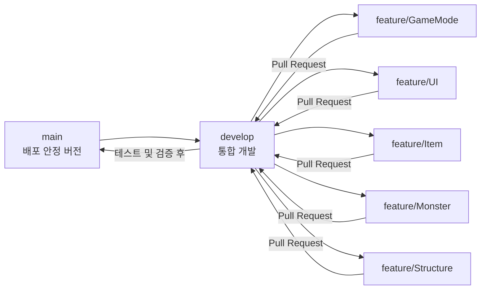
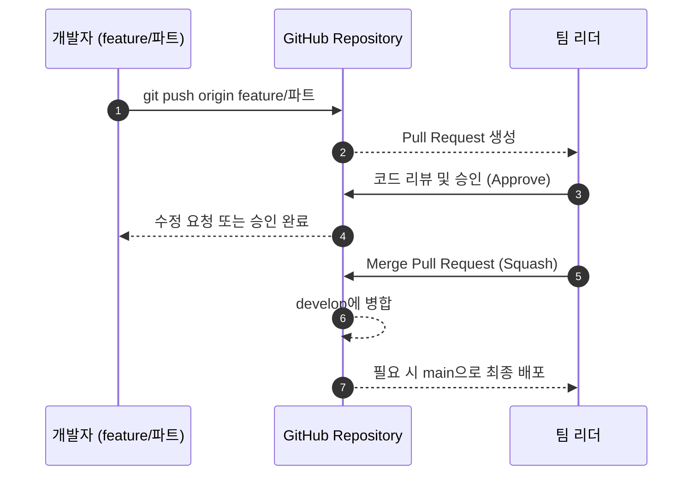
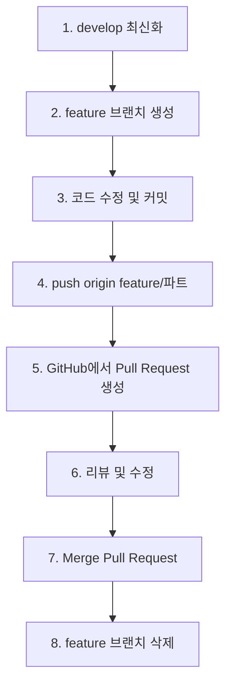

# TenTenTown 팀 Git 협업 매뉴얼

## 0) 목표

* `main`은 **완성본(배포/시연용)**
* `develop`은 **통합 개발용(모든 코드 리뷰 후 병합)**
* 각자 파트는 **feature/파트명** 브랜치에서 작업
* 모든 병합은 **Pull Request(PR)** 과정을 거쳐 승인 후 반영

---

## 1) 브랜치 전략



### 브랜치 역할

| 브랜치         | 역할                         | 규칙            |
| ----------- | -------------------------- | ------------- |
| `main`      | 배포용 / 안정 버전                | 직접 커밋 금지      |
| `develop`   | 통합 개발                      | 모든 작업은 PR로 병합 |
| `feature/*` | 개인 파트 작업 (예: `feature/UI`) | 각 담당자별 생성     |

---

## 2) 작업 흐름



### 핵심 규칙

1. 모든 작업은 **feature 브랜치**에서 시작
2. 코드 완성 후 **Pull Request → 리뷰 → Merge**
3. `develop`에는 직접 커밋하지 않음
4. `main`은 오직 시연 또는 릴리스용

---

## 3) 브랜치 생성부터 병합까지



### 명령어 예시

```bash
git checkout develop
git pull origin develop
git checkout -b feature/GameMode

# 작업 후
git add .
git commit -m "feat(GameMode): 웨이브 시스템 초기 구현"
git push -u origin feature/GameMode
```

---

## 4) Pull Request 작성 방법

1. GitHub 저장소 접속 → **Compare & Pull Request**
2. Base: `develop`, Compare: `feature/파트명`
3. PR 제목 예시

   * `[Feature] GameMode 웨이브 시스템 추가`
4. 본문 템플릿

```
### 목적
- (변경 이유 요약)

### 주요 변경 내용
- (핵심 코드 요약)

### 테스트 방법
- (빌드/실행 방법)

### 영향 범위
- (다른 파트 영향 여부)
```

5. 리뷰어 지정 → 리뷰 승인 → “Squash and merge”

---

## 5) 개발 전 세팅

```bash
# 최초 클론
git clone <repo-url>
cd <repo>

# LFS 설정 (Unreal 필수)
git lfs install
git lfs track "*.uasset" "*.umap" "*.wav" "*.png"
git add .gitattributes
git commit -m "chore: add LFS tracking for Unreal assets"
git push origin develop
```

> `.gitignore`에는 반드시
> `Binaries/`, `Intermediate/`, `Saved/`, `DerivedDataCache/` 포함되어야 합니다.

---

## 6) 일상 작업 루틴

1. `develop` 최신화

   ```bash
   git checkout develop
   git pull origin develop
   ```
2. `feature` 브랜치에서 작업

   ```bash
   git checkout feature/UI
   ```
3. 커밋 후 푸시

   ```bash
   git add .
   git commit -m "fix(UI): HP바 위치 조정"
   git push
   ```
4. PR 생성 후 리뷰 요청
5. 승인 → Merge → 브랜치 삭제

---

## 7) 충돌 해결 가이드

```bash
git fetch origin
git rebase origin/develop

# 충돌 파일 수정 후
git add <파일명>
git rebase --continue

git push --force-with-lease
```

* `.uasset` / `.umap` 충돌은 병합 불가 → **작업자 간 조율 필요**
* 가능하면 맵/에셋은 **한 사람만 편집**

---

## 8) 커밋 / PR 체크리스트

* [ ] 빌드/플레이 확인 완료
* [ ] 불필요한 로그/주석 제거
* [ ] `develop` 기준으로 리베이스
* [ ] PR 본문 템플릿 작성
* [ ] 큰 변경은 이미지/영상 첨부

---

## 9) 명령어 요약

```bash
# 새 기능 작업
git checkout develop && git pull
git checkout -b feature/Item
git add .
git commit -m "feat(Item): 아이템 획득 로직 추가"
git push -u origin feature/Item

# 최신화
git fetch origin
git rebase origin/develop

# 병합 후 정리
git branch -d feature/Item
git push origin --delete feature/Item
```

---

## 10) 리포지토리 보호 규칙

| 브랜치         | 권한     | 리뷰       | 병합 방식  |
| ----------- | ------ | -------- | ------ |
| `main`      | PR만 허용 | 2명 이상 권장 | Squash |
| `develop`   | PR 권장  | 1명 이상    | Squash |
| `feature/*` | 자유 작업  | 개인 전용    | -      |

---

## 11) LFS 및 Unreal 전용 설정

`.gitattributes`

```
*.uasset filter=lfs diff=lfs merge=lfs -text
*.umap filter=lfs diff=lfs merge=lfs -text
*.png filter=lfs diff=lfs merge=lfs -text
*.wav filter=lfs diff=lfs merge=lfs -text
```

`.gitignore`

```
Binaries/
DerivedDataCache/
Intermediate/
Saved/
.vs/
*.sln
```
