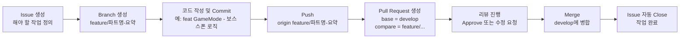
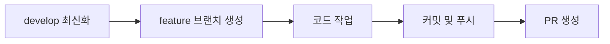
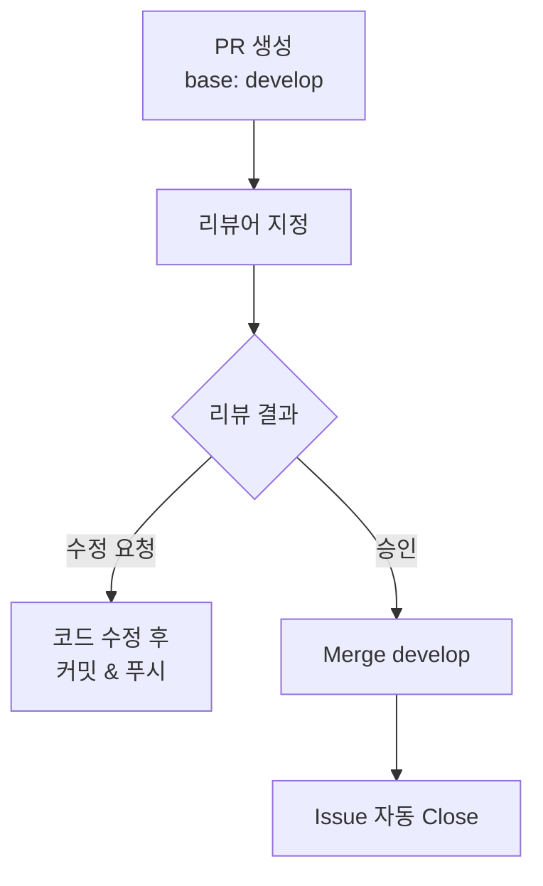
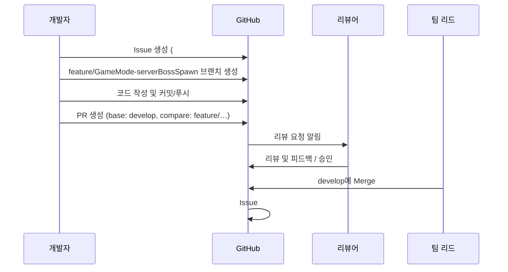

# Git 협업 및 Pull Request 매뉴얼 (팀 공통)

---

## 1. 전체 흐름 요약



---

## 2. Issue 생성

| 구분          | 설명                                        |
| ----------- | ----------------------------------------- |
| **언제 작성하나** | 새로운 기능, 버그 수정, 리팩터링 등 코드 변경이 있을 때         |
| **제목 규칙**   | `[파트] 작업 요약`  예: `[GameMode] 보스 스폰 조건 구현` |
| **내용 구성**   | 목적 / 작업 범위 / 체크리스트 / 영향 범위 / 테스트 방법       |

### Issue 예시

```markdown
## 목적
플레이어 레벨이 10이 되면 보스를 소환하는 기능 구현 필요

## 작업 범위
- GameMode에 BossSpawn 함수 추가
- GameState에 Phase 반영
- HUD에 보스 등장 신호 송출

## 체크리스트
- [ ] 서버 권한에서만 스폰되도록 처리
- [ ] 보스 중복 생성 방지
- [ ] GameOver 조건 영향 없는지 확인

## 예상 영향 범위
- MainGameMode.h / .cpp
- MainGameState.h / .cpp

## 테스트 방법
- 레벨 10 미만: 보스 스폰 X
- 레벨 10 도달: 보스 1회 생성
```

---

## 3. 브랜치 전략



### 브랜치 이름 규칙

형식:
`feature/<파트명>-<요약>`
또는
`bugfix/<파트명>-<요약>`

예시:

* `feature/GameMode-serverBossSpawn`
* `feature/UI-hudHealthBar`
* `bugfix/Item-duplicatePickup`

### 생성 순서

```bash
git checkout develop
git pull origin develop
git checkout -b feature/GameMode-serverBossSpawn
```

작업은 항상 `feature/...` 브랜치에서만 진행한다.

---

## 4. 커밋 메시지 컨벤션

| 타입       | 의미         | 예시                                |
| -------- | ---------- | --------------------------------- |
| feat     | 새 기능 추가    | `feat(GameMode): 보스 스폰 로직 추가`     |
| fix      | 버그 수정      | `fix(UI): HP바 음수 표시 문제 수정`        |
| refactor | 구조 개선      | `refactor(Item): Chest 드랍 처리 함수화` |
| docs     | 문서 수정      | `docs: README 협업 가이드 추가`          |
| style    | 포맷, 네이밍 변경 | `style: 변수명 통일`                   |
| test     | 테스트 코드 추가  | `test(GameMode): 스폰 로직 테스트`       |
| chore    | 설정, 빌드 관련  | `chore: .gitignore 업데이트`          |

---

## 5. Pull Request (PR)

### PR 생성 절차

1. 작업 완료 후 커밋 & 푸시

   ```bash
   git add .
   git commit -m "feat(GameMode): 보스 스폰 로직 추가"
   git push origin feature/GameMode-serverBossSpawn
   ```

2. GitHub에서 `Compare & pull request` 클릭

   * base: **develop**
   * compare: **feature/...**

3. PR 제목
   `[파트] 작업 요약 (Closes #이슈번호)`
   예: `[GameMode] 보스 스폰 구현 (Closes #12)`

4. PR 본문 템플릿

```markdown
## 작업 내용
- 레벨 10 도달 시 서버에서 보스 1회 생성
- GameState에 Phase 반영
- HUD에 보스 등장 신호 송출

## 변경 파일
- MainGameMode.h / .cpp
- MainGameState.h / .cpp

## 테스트 방법
- 레벨 9: 보스 생성 X
- 레벨 10: 보스 1회 생성
- 이후 중복 생성 없음

## 고려 사항
- GameMode만 수정 (UI는 별도 PR 예정)
```

---

## 6. 리뷰 & 머지 프로세스



### 규칙

* 리뷰는 최소 1명 이상에게 요청
* base는 항상 `develop`
* main에 직접 PR 금지
* 수정사항 발생 시 같은 브랜치에 커밋 후 다시 push
* Approve 후 리드 또는 지정자만 머지 수행

---

## 7. 머지 규칙 요약

| 구분       | 규칙                                   |
| -------- | ------------------------------------ |
| Merge 대상 | develop 브랜치만                         |
| main 반영  | 안정 빌드 시점에만                           |
| 직접 커밋    | main, develop에서 직접 커밋 금지             |
| 자동 Close | PR 제목에 `Closes #번호` 포함 시 Issue 자동 종료 |

---

## 8. 전체 절차 예시



---

## 9. 핵심 체크리스트

| 항목      | 규칙                                        |
| ------- | ----------------------------------------- |
| Issue   | 모든 작업은 Issue에서 시작                         |
| 브랜치     | `feature/<파트>-<요약>` or `bugfix/<파트>-<요약>` |
| Commit  | `타입(파트): 한 일 요약`                          |
| Push    | origin feature/...                        |
| PR Base | develop (main 금지)                         |
| PR 제목   | `[파트] 요약 (Closes #이슈번호)`                  |
| 리뷰      | 최소 1명 이상 승인 필요                            |
| Merge   | 리드만 수행                                    |
| main    | 안정 빌드 전용                                  |

