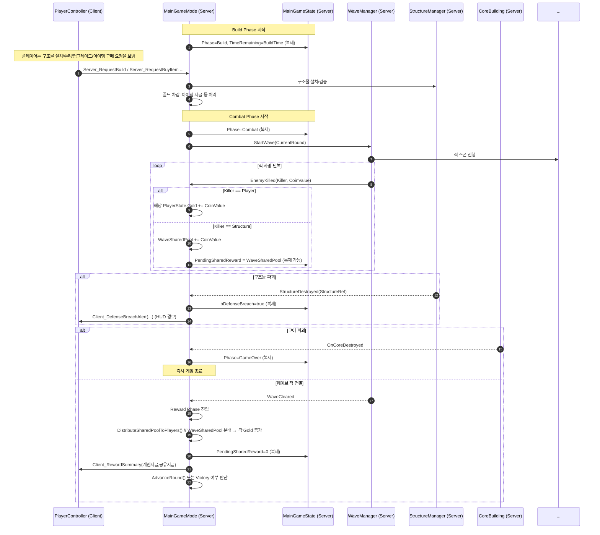
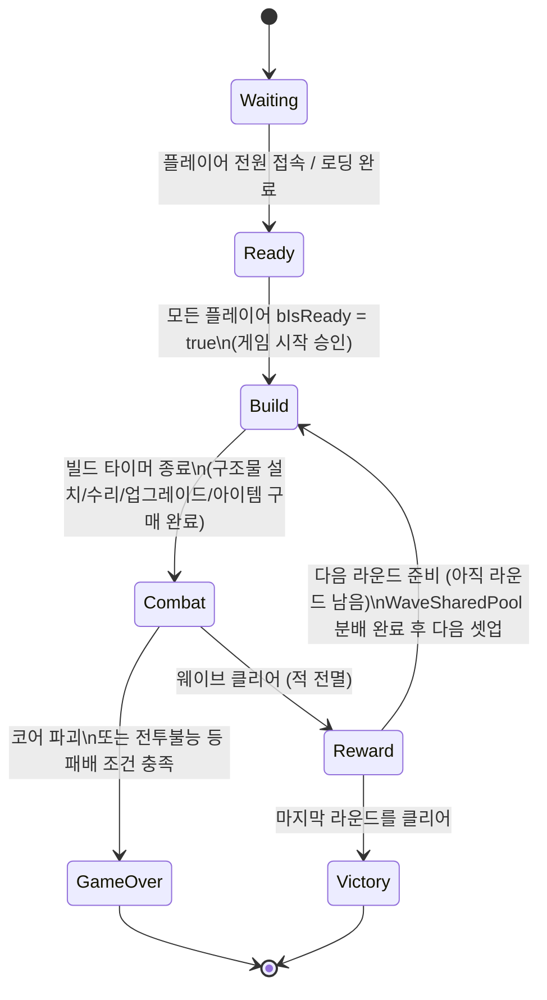
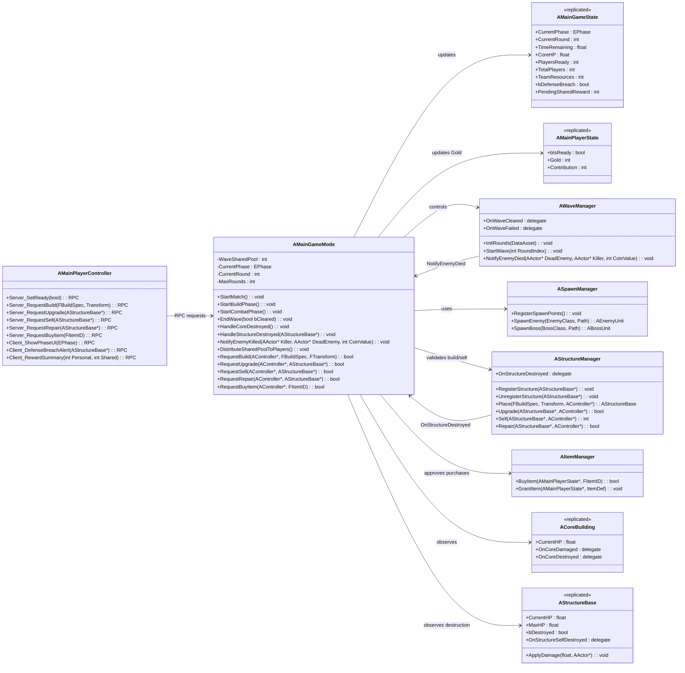

# TenTenTown – GameMode & Server Class Design (최신안)

> 범위: 서버 권한(Authority) 기준으로 동작하는 핵심 게임 진행 로직과 연동 지점.
> 포함: 라운드/페이즈, 방어 구조물 파괴, 코어 파괴에 따른 게임오버, 전투 중 재화 획득 및 분배, 아이템 구매 흐름.

---

## 1) 서버 전역 규칙

* 플레이어 수: 1~4인. 최소 인원과 매칭은 외부에서 결정하고, GameMode는 “모두 준비(Ready)” 여부만 체크하여 시작.
* 라운드(웨이브): 난이도에 따라 총 라운드 수가 정해짐. 각 라운드는 “Build → Combat → Reward”를 기본 사이클로 가짐.
* 페이즈(Phase): Waiting → Ready → Build → Combat → Reward → (Victory | GameOver).

  * 현재 Phase는 서버가 결정하고 GameState로 복제.
  * UI는 GameState의 Phase만 보고 현재 화면 모드를 전환.
* 코어(ACoreBuilding): HP가 0이 되면 즉시 GameOver.

  * 코어 HP는 복제되어 모든 클라이언트 HUD에서 볼 수 있어야 함.
* 구조물(타워/배리케이드 등, AStructureBase):

  * 서버가 허가해 스폰한 방어 자산.
  * HP를 가지며 적에게 공격받아 파괴될 수 있음.
  * 파괴 시 “방어선 붕괴” 이벤트로 간주되고, GameMode가 이를 감지해 전황 알림을 띄움.
* 경제(골드):

  * 모든 아이템은 골드로만 구매.
  * 적 처치 시 코인(골드)이 발생.

    * 플레이어가 처치한 적 → 즉시 그 플레이어 개인 골드에 반영.
    * 구조물이 처치한 적 → 이번 웨이브의 “공용 웨이브 풀(WaveSharedPool)”에 적립.
  * Combat Phase가 끝나고 Reward Phase로 넘어갈 때, WaveSharedPool을 현재 참가 인원 수로 나누어 각 플레이어에게 균등 분배하고, 풀은 초기화.
* 구조물/아이템/수리:

  * Build Phase 동안 플레이어는 서버에 “구조물 설치/업그레이드/수리/판매” 요청을 보낼 수 있다.
  * 또한 Build Phase 동안 또는 허용된 타이밍에 아이템 구매 요청을 보낼 수 있다.
  * 이 모든 것은 서버 측 검증 이후만 실제 반영된다.

---

## 2) 핵심 서버 엔티티 (요약)

### AMainGameMode (서버 전용)

* 게임 전체 진행과 규칙 판정의 중심.
* Phase 전환 (Build → Combat → Reward 등).
* 웨이브 시작/종료, 라운드 진행.
* 승리/패배 판정 (코어 파괴 / 라운드 완주).
* 구조물 파괴 이벤트, 코어 파괴 이벤트, 플레이어 전투불능 등 전황 이벤트를 수집하고 반응.
* 전투 중 적 처치 보상 로직 처리:

  * 플레이어 킬 → 개인 골드 즉시 추가.
  * 구조물 킬 → WaveSharedPool에 누적.
* 라운드 종료 시 WaveSharedPool을 모든 현재 참가자에게 균등 분배.
* 아이템 구매 요청/승인 (골드 차감 후 아이템 지급은 ItemManager에 위임).
* 구조물 설치/업그레이드/판매/수리 요청 승인 (실행은 StructureManager에 위임).

### AMainGameState (복제됨)

* 전역 HUD가 참조할 정보.

  * CurrentPhase (Waiting/Ready/Build/Combat/Reward/Victory/GameOver)
  * CurrentRound, TimeRemaining(현재 Phase 잔여 시간)
  * CoreHP
  * PlayersReady / TotalPlayers
  * TeamResources (팀 공유 자원, 예: 구조물 설치용 등)
  * bDefenseBreach (중요 방어선이 파괴되었음을 알리는 경보)
  * PendingSharedReward (이번 웨이브 끝나면 분배 예정인 공용 코인 총합, 선택적으로 복제)
* 클라이언트 UI는 OnRep 훅 등으로 이 값이 갱신될 때마다 HUD를 업데이트한다.

### AMainPlayerState (복제됨)

* 개인별 HUD/스코어보드가 볼 수 있는 정보.

  * bIsReady: Ready Phase에서의 준비 여부.
  * Gold: 플레이어 개인 골드. 아이템 구매, 일부 구조물 조작 비용 등에 사용.
  * Contribution: 전투 기여도(딜량/수리 등) 추후 결과 화면·랭킹용.
* 라운드 종료 시 분배된 WaveSharedPool은 최종적으로 Gold에 더해진다.

### AMainPlayerController

* 클라이언트 ↔ 서버 인터페이스.
* 클라이언트 쪽 입력을 서버에 알리는 역할:

  * 준비 상태 토글
  * 구조물 설치/업그레이드/수리/판매 요청
  * 아이템 구매 요청
* 서버에서 전황 알림을 보내는 통로:

  * Phase 전환 알림 (Build UI 띄워라, Combat UI 띄워라 등)
  * 방어선 붕괴 경보
  * 라운드 보상 요약 (이번 라운드에서 얻은 개인 골드 / 공유 분배 골드 등)

### AWaveManager (서버 전용)

* Combat Phase에서 웨이브(라운드) 진행을 실제로 구동.
* 웨이브 플랜(스폰 시간표/보스 여부 등)을 따라 적을 계속 스폰시키도록 SpawnManager를 호출.
* 적이 사망할 때마다 GameMode에 “누가 잡았고 얼마짜리인지” 보고.

  * GameMode는 이 정보를 사용해서 개인 Gold 또는 WaveSharedPool을 갱신.
* 해당 라운드의 적이 모두 정리되면 웨이브 클리어 신호를 GameMode로 보냄.
* 만약 코어가 파괴되거나 조건부 실패라면 웨이브 실패 신호를 보냄.

### ASpawnManager (서버 전용)

* 실제 적/보스 스폰 담당.
* 스폰 포인트, 경로 설정, 네비게이션 경유지 등을 관리.
* AWaveManager의 요청에 따라 적/보스를 SpawnActor로 생성한다.

### AStructureManager (서버 전용)

* 구조물(타워/배리케이드/트랩 등)의 전 생애주기를 관리.

  * 설치(Place)
  * 업그레이드(Upgrade)
  * 판매(Sell)
  * 수리(Repair)
  * 파괴(Unregister)
* 서버에서만 비용 검증/배치 가능 여부 검사/쿨다운 여부 등을 확인하고 실제 스폰 및 갱신을 수행.
* 각 구조물은 HP를 가지고 있고 적에게 공격받아 파괴될 수 있다.
* 구조물이 파괴되면 StructureManager는 GameMode에 “방어선 붕괴” 이벤트를 통지한다.

  * GameMode는 GameState.bDefenseBreach를 true로 세팅하고, PlayerController들에게 HUD 경보를 날릴 수 있다.

### AItemManager (서버 전용)

* 아이템 구매/지급의 관문.
* 모든 아이템은 골드로만 획득 가능.
* 서버가 플레이어의 Gold를 확인하고, 충분하면 차감한 뒤 해당 아이템을 인벤토리에 지급한다.
* 실제 인벤토리 시스템(플레이어 캐릭터가 들고 있는 슬롯 등)으로 아이템을 넣는 책임도 서버 측에서 처리한다.
* Combat / Build 어느 타이밍에 구매 가능한지는 GameMode/Phase 정책에 따른다.

### ACoreBuilding (복제됨)

* 방어 대상 코어.
* HP가 복제되므로 모든 클라이언트 HUD에서 코어 체력바를 볼 수 있다.
* 적의 공격은 서버에서만 코어 HP를 깎는다.
* HP ≤ 0이 되면 “코어 파괴됨” 이벤트를 GameMode로 알리고, GameMode는 즉시 GameOver Phase로 전환한다.

### AStructureBase (복제됨)

* 플레이어가 설치하는 방어 구조물의 베이스 클래스.
* HP / MaxHP / 파괴 여부(bDestroyed 등)가 복제된다.
* 적이 구조물을 공격하면 서버에서만 구조물 HP가 깎인다.
* HP ≤ 0이 되면 구조물은 파괴 상태로 전환되고, 방어선에서 제거된다.

  * 이때 StructureManager와 GameMode에 “방어선 붕괴” 이벤트가 전달된다.
* 구조물이 적을 처치할 수 있다.

  * 구조물이 적을 마지막으로 죽이면 그 처치 보상 코인은 WaveSharedPool에 적립된다 (즉시 플레이어 개인한테 가지 않음).

---

## 3) 경제(골드) 처리 규칙

### 전투 중 (Combat Phase)

* 적 사망 → WaveManager가 GameMode에 보고:

  * 누가 잡았는지(Killer)와 그 적의 코인 가치(CoinValue).
* GameMode는 Killer가 누구인지 보고 처리:

  * Killer가 플레이어(또는 그 플레이어의 무기/스킬)라면:
    → 그 플레이어의 AMainPlayerState.Gold에 바로 추가.
  * Killer가 구조물(AStructureBase)이라면:
    → GameMode의 WaveSharedPool에 누적.
* GameState는 이 WaveSharedPool을 `PendingSharedReward` 같은 필드로 복제해 HUD에서 “라운드 끝나면 이만큼 나눠가질 예정”으로 보여줄 수 있다(원한다면).

### 라운드 종료 (Combat → Reward Phase)

* GameMode는 Reward Phase 진입 시 WaveSharedPool을 분배한다.

  * 현재 참여 중인 플레이어 수(세션에 살아 있고 연결된 사람 수)를 계산.
  * WaveSharedPool / 인원수 = 1인당 균등 몫(정수 기준 정책).
  * 각 플레이어의 Gold에 그 몫만큼 추가.
* 분배 후 WaveSharedPool은 0으로 초기화되고, GameState.PendingSharedReward도 0으로 맞춘다.
* 그 다음 보상(예: 라운드 클리어 보너스, 난이도 보너스 등)은 AItemManager 등을 통해 추가로 지급할 수 있다.

### 아이템 구매

* 플레이어 클라이언트는 “아이템을 구매하고 싶다”를 PlayerController → 서버 RPC로 요청한다.
* GameMode(또는 GameMode가 호출하는 AItemManager)가:

  * 해당 PlayerState.Gold가 가격 이상인지 확인.
  * 충분하면 Gold 차감 후 해당 아이템을 인벤토리에 지급.
  * 불충분하면 거부.
* 요약: 전투에서 얻은 골드 + 웨이브 종료 시 분배된 골드가 결국 다음 Build Phase에서의 생존력(아이템 구매, 구조물 보강)을 만든다.

---

## 4) 서버 흐름 시퀀스 개요

### 빌드 → 전투 → 보상 사이클 (핵심 이벤트 포함)

---

## 5) Phase 상태머신 (최종)

* Ready: 다음 라운드로 들어가기 전 “준비됐는가?” 상태
* Build: 구조물/아이템 준비 시간
* Combat: 실제 방어/전투 시간 (골드 획득, 구조물 파괴 가능)
* Reward: 웨이브 종료 후 분배 및 보상 시간
* Victory: 모든 라운드 생존
* GameOver: 코어 파괴 등으로 패배

---

## 6) 요약

* **AMainGameMode**
  게임의 뇌.
  페이즈를 돌리고, 웨이브를 시작·끝내고, 코어/구조물 파괴를 감지하고, 골드를 분배하고, 아이템 구매를 승인한다.

* **AMainGameState**
  모두가 봐야 하는 스냅샷.
  현재 Phase, 라운드, 남은 시간, 코어 HP, 팀 자원, 방어선 붕괴 여부, 라운드 종료 시 분배 예정 금액까지 포함해 복제된다.

* **AMainPlayerState**
  각 플레이어의 상태(Ready 여부, 개인 골드, 기여도)를 복제한다.
  웨이브 종료 후 공용 재화 풀은 여기 Gold로 분배된다.

* **AWaveManager / ASpawnManager**
  적/보스 스폰과 웨이브 클리어 판정을 책임진다.
  적이 죽을 때마다 “누가 잡았고 얼마짜리인지” GameMode에 보고해 경제 처리를 발생시킨다.

* **AStructureManager / AStructureBase**
  구조물 설치/업그레이드/수리/판매, 구조물 HP 및 파괴 관리.
  구조물이 부서지면 GameMode가 방어선 붕괴를 인지하고 HUD에 경보를 뿌린다.
  구조물이 적을 잡으면 보상은 WaveSharedPool로 쌓인다.

* **ACoreBuilding**
  코어 HP를 복제하고, 파괴되면 즉시 GameOver를 일으킨다.

* **AItemManager**
  아이템은 “돈 주고 사는 것”만 허용한다.
  서버가 Gold를 확인하고 차감한 다음 아이템을 인벤토리에 지급한다.

