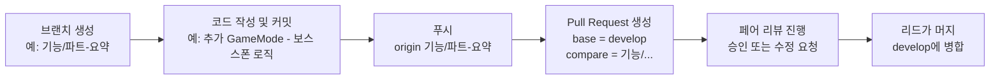
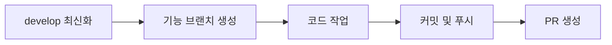
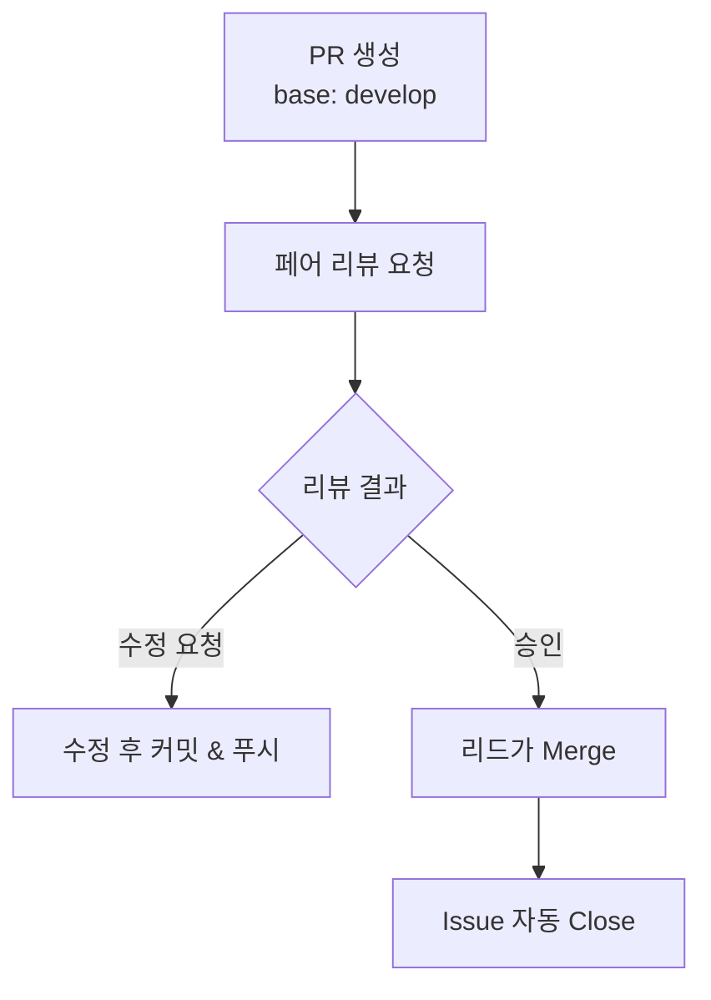
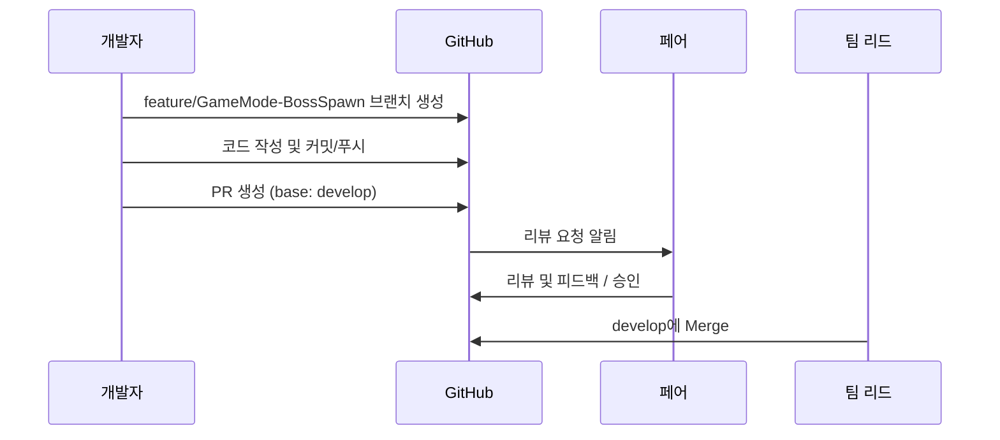

# Git 협업 및 Pull Request 매뉴얼

## 1. 전체 흐름 요약



## 2. 브랜치 전략



### 브랜치 이름 규칙

형식:
`추가/<파트>-<요약>`
또는
`버그수정/<파트>-<요약>`

예시:

* `feature/GameMode-BossSpawn`
* `feature/UI-HPbar`
* `fix/Item-heal`

### 생성 순서

```bash
git checkout develop
git pull origin develop
git checkout -b 기능/GameMode-BossSpawn
```

> 모든 작업은 `기능/...` 브랜치에서만 진행합니다.

---

## 3. 커밋 메시지 규칙 

| 타입           | 의미             | 예시                            |
| ------------ | -------------- | ----------------------------- |
| **feature**     | 새 기능 추가        | `추가(GameMode): 보스 스폰 로직 구현`   |
| **fix**      | 버그 수정          | `수정(UI): HP바 음수 표시 문제 해결`     |
| **refactor** | 구조/로직 개선       | `개선(Item): 드랍 처리 함수로 분리`      |
| **docs**     | 문서 내용 변경       | `문서: README 협업 가이드 추가`        |
| **style**    | 코드 포맷/네이밍 등 변경 | `형식: 변수명 통일`                  |
| **test**     | 테스트 코드 추가      | `테스트(GameMode): 스폰 로직 테스트 추가` |
| **chore**    | 설정, 빌드, 의존성 관련 | `환경: .gitignore 수정`           |


---

## 4. Pull Request (PR)

### PR 생성 절차

1. 작업 완료 후 커밋 & 푸시

   ```bash
   git add .
   git commit -m "추가(GameMode): 보스 스폰 로직 구현"
   git push origin 기능/GameMode-보스스폰
   ```

2. GitHub에서 `Compare & pull request` 클릭

   * base: **develop**
   * compare: **기능/...**

3. PR 제목
   `[파트] 작업 요약`
   예: `[GameMode] 보스 스폰 구현`

4. PR 본문 템플릿

```markdown
## 작업 내용
- 레벨 10 도달 시 서버에서 보스 1회 생성
- GameState에 Phase 반영
- HUD에 보스 등장 신호 송출

## 변경 파일
- MainGameMode.h / .cpp
- MainGameState.h / .cpp

## 테스트 방법
- 레벨 9: 보스 생성 X
- 레벨 10: 보스 1회 생성
- 이후 중복 생성 없음

## 고려 사항
- GameMode만 수정 (UI는 별도 PR 예정)
```

---

## 5. 리뷰 & 머지 프로세스



### 페어 리뷰 조합

| 페어 | 구성원     |
| -- | ------- |
| 1조 | 윤호 ↔ 순호 |
| 2조 | 서호 ↔ 정민 |
| 3조 | 효종 ↔ 동권 |
| 4조 | 선우 ↔ 진권 |

### 리뷰 규칙

* 리뷰는 **페어 1조 단위로 승인 필요**
* base는 항상 `develop`
* main으로 직접 PR 금지
* 수정사항 발생 시 동일 브랜치에 커밋 후 push
* Approve 후 **리드만 머지 가능**

---

## 6. 머지 규칙 요약

| 구분       | 규칙                                   |
| -------- | ------------------------------------ |
| Merge 대상 | develop 브랜치만                         |
| main 반영  | 안정 빌드 시점에만                           |
| 직접 커밋    | main, develop 직접 커밋 금지               |
| 자동 Close | PR 제목에 `Closes #번호` 포함 시 Issue 자동 종료 |

---

## 7. 전체 절차 예시



---

## 8. 핵심 체크리스트

| 항목      | 규칙                                 |
| ------- | ---------------------------------- |
| 브랜치     | `기능/<파트>-<요약>` or `버그수정/<파트>-<요약>` |
| Commit  | `타입(파트): 한 일 요약`                   |
| Push    | origin 기능/...                      |
| PR Base | develop (main 금지)                  |
| PR 제목   | `[파트] 요약`           |
| 리뷰      | 페어 1조 단위 승인 필요                     |
| Merge   | 리드만 수행                             |
| main    | 안정 빌드 전용                           |

---

