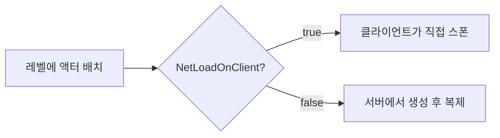
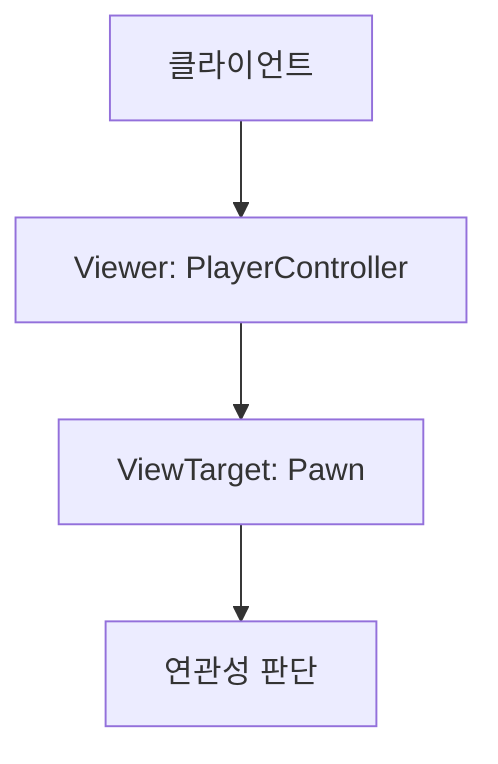

# 네트워크 액터 레플리케이션 심화

## 오늘 배운 핵심 요약

* 모든 액터를 실시간으로 전송하면 비효율적이라 **연관성(Relevancy)** 기준으로 필요한 액터만 복제함.
* `NetLoadOnClient`, `AlwaysRelevant`, `OnlyRelevantToOwner`, `NetCullDistance` 등으로 복제 범위를 조절함.
* `OnRep_` 함수로 값 변경 시점에만 UI 갱신 같은 작업을 호출해 효율적으로 동기화함.
* `NetUpdateFrequency`, `NetPriority`로 네트워크 부하를 관리함.
* `NetDormancy`로 자주 변하지 않는 액터는 휴면 상태로 관리함.
* `Conditional Property Replication`으로 속성 복제를 조건부로 조절함.

---

## NetLoadOnClient



예시:

* 맵에 고정된 벽, 건물 같은 액터 → `NetLoadOnClient = true`로 설정.
* 서버가 직접 제어해야 하는 보스 몬스터 → `false`로 설정.

---

## Replication Notify

* `ReplicatedUsing`으로 설정한 속성이 복제될 때 자동 호출되는 함수임.
* 함수명은 `OnRep_`으로 시작해야 하고 클라이언트에서만 호출됨.
* 서버에서도 호출하려면 직접 호출해야 함.

| 구분     | C++ `OnRep_` | Blueprint RepNotify |
| ------ | ------------ | ------------------- |
| 호출 위치  | 클라이언트        | 서버+클라이언트            |
| 명시적 호출 | 가능           | 불가능                 |
| 호출 시점  | 값 변경 시       | 서버 항상, 클라 값 변경 시    |

예시 상황:

* `Health` 값이 서버에서 바뀌면, 클라이언트에서 `OnRep_Health()`가 호출되어 HP UI를 갱신함.

```cpp
UPROPERTY(ReplicatedUsing = OnRep_Health)
float Health;

UFUNCTION()
void OnRep_Health()
{
    UpdateHealthUI();
}
```

---

## NetUpdateFrequency

* 초당 최대 복제 시도 횟수. 기본값은 100.
* `GameState`는 10, `PlayerState`는 1로 낮음.
* 서버 Tick Rate와 서버 성능에 따라 실제 빈도 달라짐.

---

## 액터 연관성(Relevancy) 판단 기준



| 속성                   | 설명               | 예시                  |
| -------------------- | ---------------- | ------------------- |
| Owner                | 액터 소유자           | 캐릭터가 들고 있는 무기       |
| Instigator           | 영향을 준 Pawn       | 공격한 캐릭터             |
| AlwaysRelevant       | 항상 복제            | 모든 플레이어가 보는 보스      |
| NetUseOwnerRelevancy | 소유자 연관성 사용       | 무기는 캐릭터가 안 보이면 안 보임 |
| OnlyRelevantToOwner  | 소유자만 보임          | 미니맵 표시용 길라잡이        |
| NetCullDistance      | 일정 거리 이상은 복제 안 함 | 멀리 있는 나무 잎사귀        |

---

## NetPriority

* 네트워크 대역폭이 한정되어 있어 우선순위를 계산해 전송함.
* `GetNetPriority()`에서 연관성, 거리, 시야 등을 고려함.
* 혼잡할 땐 Priority 낮은 액터는 다음 Tick에서 전송함.

| 상황           | 가중치 |
| ------------ | --- |
| ViewTarget이면 | 4.0 |
| 가까이 보이면      | 2.0 |
| 멀리 있으면       | 0.2 |

---

## NetDormancy

* 자주 변하지 않는 액터는 휴면 상태로 전환해 네트워크 부하를 줄임.

| 상태                | 설명            |
| ----------------- | ------------- |
| `DORM_Never`      | 절대 휴면 안 됨     |
| `DORM_Awake`      | 활성 상태         |
| `DORM_Initial`    | 시작 시 휴면       |
| `DORM_DormantAll` | 모든 클라이언트에서 휴면 |

---

## Conditional Property Replication

* 한 번 등록된 속성은 해제 불가 → 조건식으로 복제 여부를 제어함.
* 값이 자주 변하면 조건 체크가 오히려 부담됨.

```cpp
// 조건부 복제 예시
DOREPLIFETIME_CONDITION(AMyCharacter, Health, COND_OwnerOnly);
```

---

## 코드 전체 예시

```cpp
UPROPERTY(ReplicatedUsing = OnRep_Health)
float Health;

UFUNCTION()
void OnRep_Health()
{
    UpdateHealthUI();
}

void GetLifetimeReplicatedProps(TArray<FLifetimeProperty>& OutLifetimeProps) const
{
    Super::GetLifetimeReplicatedProps(OutLifetimeProps);

    // 기본 복제
    DOREPLIFETIME(AMyCharacter, Health);

    // 조건부 복제
    DOREPLIFETIME_CONDITION(AMyCharacter, Ammo, COND_OwnerOnly);
}
```

---

## 체크리스트

* 레벨에 고정 배치된 액터는 `NetLoadOnClient`로 클라이언트가 직접 스폰함.
* 값 변경 시 `OnRep_` 함수로 UI나 로직을 갱신함.
* `NetPriority`와 `NetUpdateFrequency`로 네트워크 최적화함.
* 멀리 있는 액터는 `NetCullDistance`로 복제 제한함.
* 자주 변하지 않는 액터는 `NetDormancy`로 휴면 처리함.

---

## 퀴즈

1. `OnRep_` 함수는 언제 호출될까?

<details>
<summary>정답</summary>
클라이언트에서 속성이 복제될 때 호출됨. 서버에선 호출되지 않음.
</details>

2. `NetPriority`는 복제 빈도를 직접 결정하는 값일까?

<details>
<summary>정답</summary>
아님. 혼잡할 때 전송 우선순위를 정하는 값임.
</details>

3. `NetDormancy`는 어떤 액터에 적합할까?

<details>
<summary>정답</summary>
자주 변하지 않는 액터. 플레이어 캐릭터 같은 자주 변하는 액터는 부적합함.
</details>


