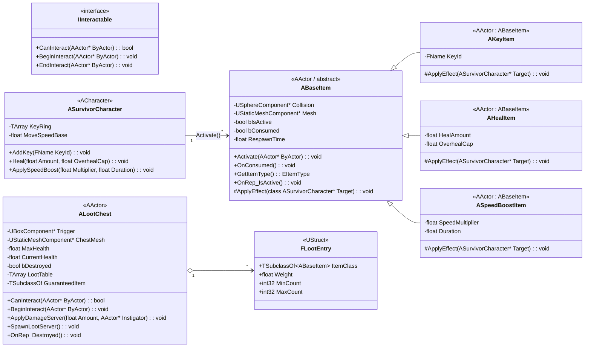
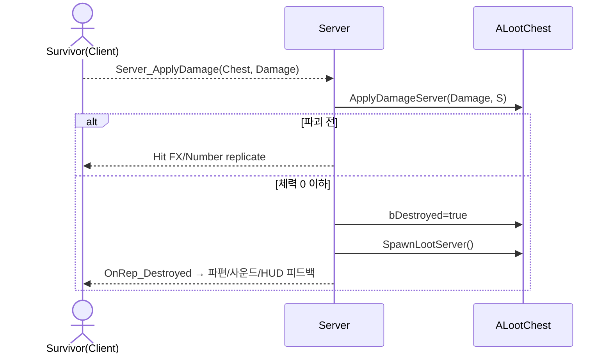
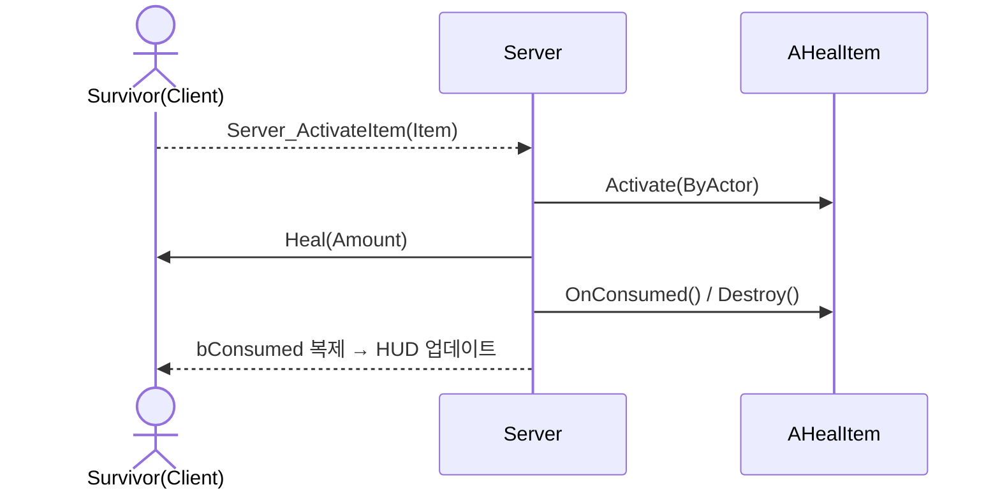
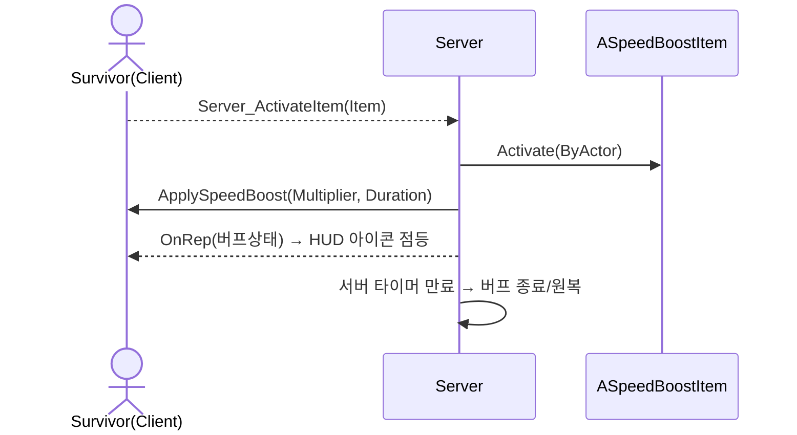

# theeleventhhour – 아이템 시스템 설계

> 범위: **아이템(열쇠 / 힐 / 이동속도 증가) + 상자(랜덤 드롭, 파괴형)** 중심. 멀티플레이(서버 권한) 전제.

---

## 1) 클래스 다이어그램 (UML)

> **확장 포인트**: 디버프/함정 아이템, 일회성 vs. 지속효과, 리스폰 정책(월드 배치/체스팅/웨이브 드롭) 등은 동일 패턴으로 추가.

---

## 2) 주요 책임 & 네트워킹 정책

* **서버 권한(Authority) 원칙**

  * 아이템 활성화/소비, 상자 파괴/드롭은 **서버에서만** 결정.
  * 상태 변수(`bIsActive`, `bConsumed`, `bDestroyed`)는 `Replicated` + `OnRep_` 콜백으로 클라 UI/FX 동기화.
  * 상호작용 입력: 클라 → `Server` RPC → 서버 검증 후 처리.

* **ABaseItem (공통 아이템 기반)**

  * 충돌 진입(Overlap) 시 안내 UI 표시(WidgetComponent는 클라 전용).
  * `Activate(ByActor)`는 서버에서만 유효, 내부에서 `ApplyEffect(Target)` 호출 후 `bConsumed=true`.
  * `bIsActive=false`면 상호작용 불가(쿨다운/리스폰 대기).

* **AKeyItem**

  * `KeyId`를 생존자 인벤토리(`KeyRing`)에 추가.
  * 사용 정책(소모/비소모)은 상위 시스템과 연동 전제로 보관형 기본.

* **AHealItem**

  * 즉시 치유. `OverhealCap`으로 상한 제어(예: 최대 체력의 120%까지).

* **ASpeedBoostItem**

  * 서버에서 버프 시작 → `OnRep`으로 클라 HUD 아이콘 점등 → 타이머 만료 시 원복.

* **ALootChest (파괴형 상자)**

  * 피해 수신(`ApplyDamageServer`)으로 `CurrentHealth` 감소.
  * 체력이 0 이하가 되면 `bDestroyed=true` 복제 → `SpawnLootServer()` 실행 → 메시/콜리전 비활성.
  * 첫 파괴 시 `GuaranteedItem` 지급 가능, 이후 룻 테이블 가중치에 따라 드롭.

---

## 3) 상호작용 시퀀스 (대표 플로우)

### 3-1) 생존자가 상자를 부숴 아이템을 획득

### 3-2) 생존자가 힐 아이템을 사용

### 3-3) 속도 버프 아이템 적용

---

## 4) 에디터 배치 & 데이터 자산

* **LootTable 데이터 관리**

  * `ALootChest::LootTable(TArray<FLootEntry>)`로 시작 → 필요 시 `UDataTable`/`UPrimaryDataAsset` 전환.
  * 예시: Key 50%, Heal 30%, SpeedBoost 20%, `GuaranteedItem`으로 첫 파괴 시 확정 지급.

* **레이아웃**

  * 맵 주요 동선/위험 지역에 **ALootChest** 배치(다수) → 키/소모품 공급원.
  * 아이템 액터는 **Collision: Overlap**(Survivor 채널만), **Spawner** 또는 월드 고정 배치 둘 다 가능.

* **HUD 연동**

  * 아이템 `OnRep`에서 **아이콘 점등/해제** 이벤트 브로드캐스트.
  * 힐/버프 적용 시 `GameMode` 또는 `PlayerState`에 통계 누적(사용 횟수 등).

---

## 5) 동기화 체크리스트

* [ ] 아이템/상자 모두 `bReplicates=true` 설정
* [ ] 상태 변수 `Replicated` + `OnRep_` 구현
* [ ] 상호작용/피해 처리 함수는 `Server, Reliable` RPC + 서버 측 검증
* [ ] 클라에서는 **시각/사운드** 즉시 재생(낙관적 피드백), **상태 변경은 서버 복제**로 확정
* [ ] 속도 버프는 **서버 타이머**로 종료 관리
* [ ] 키 인벤토리는 **PlayerState**에 보관 고려(사망/감금 등 상태 변동 시 유지 정책 정의)

---

## 6) 확장 아이디어(선택)

* **상자 파괴 저항치/방어막**: 특정 무기로만 효율적, 혹은 팀 협동 필요
* **소음 노출 시스템**: 상자 파괴 시 큰 소리 → 살인마에게 핑/미니맵 표시
* **함정 상자**: 폭발/디버프 확률 믹스
* **파편 상호작용**: 파편 밟을 때 소리 발생(추적 포인트)

---

### 전달물 요약

* UML 클래스 다이어그램(아이템/파괴형 상자/상호작용 인터페이스)
* 시퀀스 다이어그램 3종(상자 파괴/힐 사용/속도 버프)
* UE C++ 시그니처 스케치 + 복제/네트워킹 규칙
* 에디터/데이터 구성 가이드 + 체크리스트
