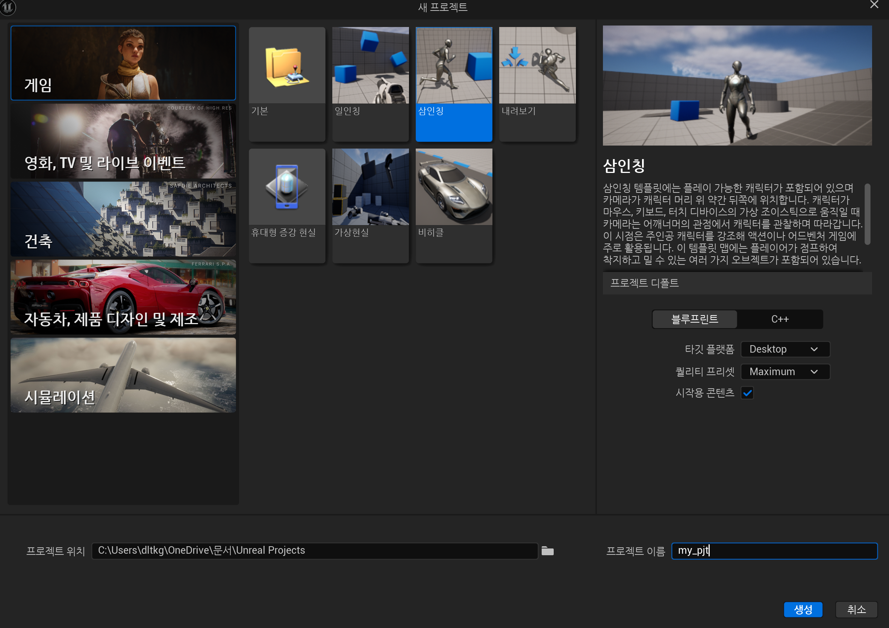
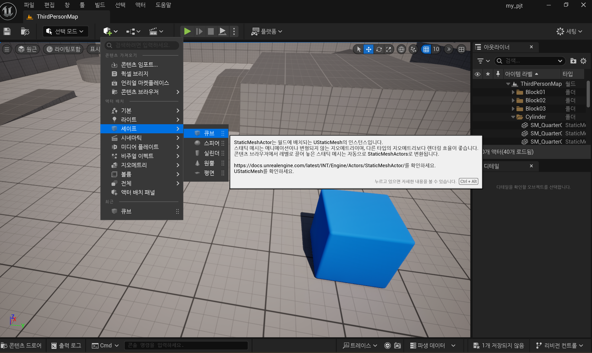
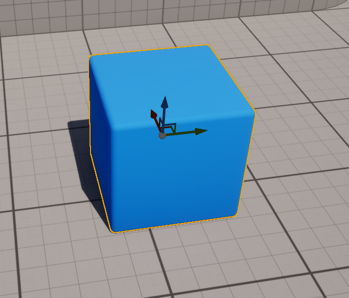
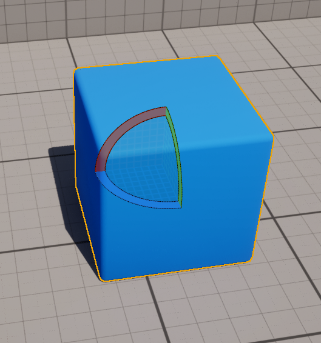
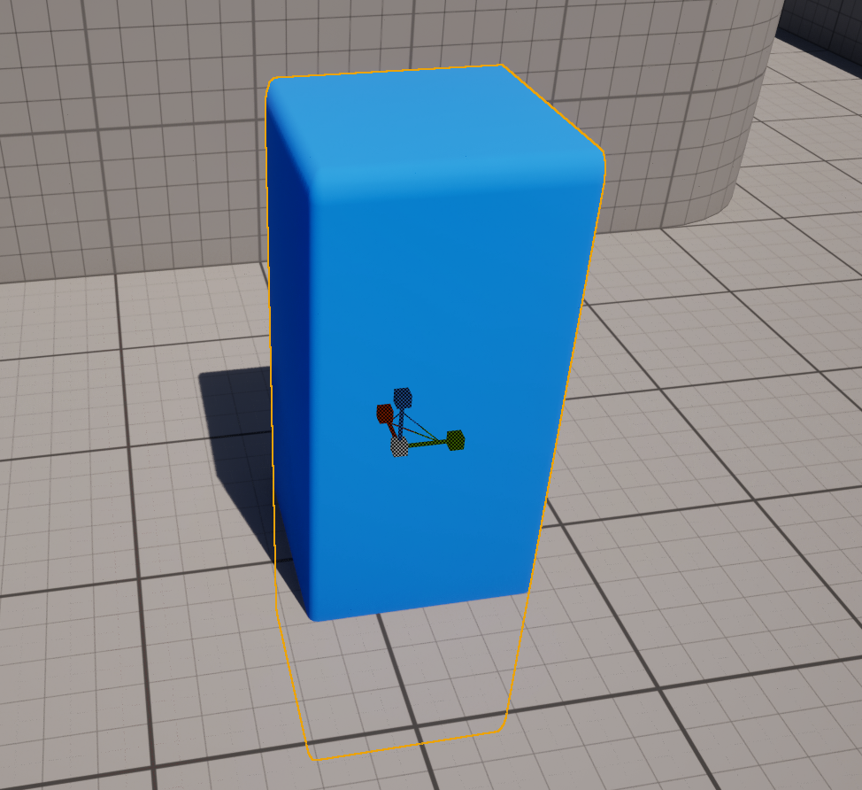
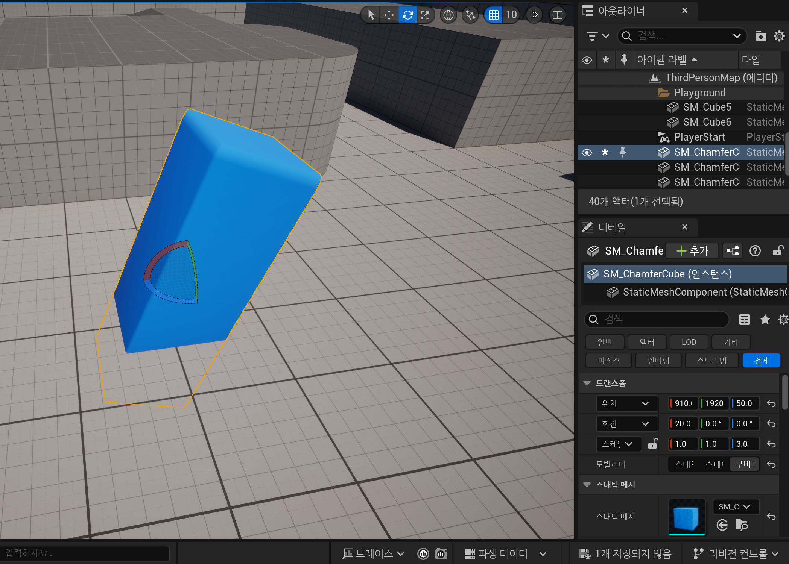

# 🎮 [TIL] Unreal Engine 5 - 첫 번째 실습 과제 (Third Person 템플릿 사용)

---

# STEP 1. 학습 내용 요약하기

## 1. Unreal Engine 5에서 "프로젝트 생성" 단계의 주요 흐름은 무엇인가요?

- 언리얼 엔진 실행 후, 다양한 **템플릿** 중 원하는 것을 선택할 수 있습니다.
- 이번 실습에서는 **"Third Person"** 템플릿을 선택했습니다.
  - 기본 캐릭터(3인칭 시점)가 제공되며, 이동 및 점프 기능이 미리 세팅되어 있습니다.
- 프로젝트 생성 시 다음 설정을 지정합니다:
  - **Starter Content** 포함 여부
  - **플랫폼 설정** (PC/콘솔 등)
  - **프로젝트 저장 위치 및 이름** 설정

✅ 요약: 템플릿 선택 → 그래픽 및 기능 설정 → 저장 → 새 프로젝트 생성

---

## 2. "에디터 인터페이스"의 핵심 요소 3가지는 무엇인가요?

- **Viewport (뷰포트)**  
  씬(Scene)과 오브젝트를 3D 공간에서 직접 보고 조작하는 작업 공간입니다.

- **Outliner (아웃라이너)**  
  현재 씬에 존재하는 모든 Actor(오브젝트)를 트리 구조로 나열해 관리할 수 있습니다.

- **Details Panel (디테일 패널)**  
  선택한 Actor의 세부 속성(위치, 회전, 크기, 머티리얼 등)을 수정할 수 있는 공간입니다.

✅ 요약: Viewport(배치) - Outliner(구조 확인) - Details(속성 수정) 세 가지가 기본입니다.

---

## 3. Unreal Engine에서 "Actor"란 무엇이며, 어떤 역할을 하나요?

- **Actor**는 언리얼 엔진 세계 안에 존재하는 **모든 객체**를 의미합니다.
- 예시: 플레이어 캐릭터, 바닥, 벽, 빛, 카메라 등
- Actor는 고유한 위치, 회전, 크기 정보를 가지며 상호작용할 수 있습니다.

✅ 요약: Actor는 게임 레벨을 구성하는 모든 구성 요소입니다.

---

# STEP 2. 실습하기

## 1. 새 프로젝트 생성

- Unreal Engine 5를 실행한 후,  
  **Third Person** 템플릿을 선택해 새 프로젝트를 생성했습니다.
- Starter Content를 **포함(Include)** 설정했으며,  
  **플랫폼은 Desktop**,  
  **그래픽 품질은 Maximum Quality**로 설정했습니다.

---

## 2. 기본 오브젝트 배치

- 뷰포트(Viewport)에서 "Place Actors" 메뉴를 열어  
  **Cube** 오브젝트를 레벨에 끌어다 배치했습니다.
- Cube 오브젝트를 이동(Move), 회전(Rotate), 스케일(Scale) 도구를 이용해 조작해 보았습니다.

 

---

## 3. Outliner와 Details 패널 확인

- Outliner 패널에서 Cube 액터가 생성된 것을 확인했습니다.
- Cube를 선택하니 Details 패널에 위치, 회전, 스케일, 머티리얼 설정 등이 표시되었습니다.
- Details 패널에서 Cube의 크기를 변경하고, 색상을 적용하는 실습을 진행했습니다.

---

# ✍️ 느낀 점

- **Third Person 템플릿**을 사용하니 기본 캐릭터가 이미 설정되어 있어  
  바로 씬을 탐색하고 테스트할 수 있어 편리했습니다.
- Viewport에서 오브젝트를 직접 배치하고  
  Outliner와 Details 패널을 통해 수정하는 기본 흐름을 체득할 수 있었습니다.
- 특히 액터(Actor) 개념이 실제로 오브젝트를 추가하고 다룰 때  
  구체적으로 체감되었고, 언리얼 에디터의 직관성에 감탄했습니다.

---

# ✨ 핵심 키워드

`#UnrealEngine5 #ThirdPerson #TIL #Actor개념 #Viewport조작 #Outliner #Details #StarterContent`
