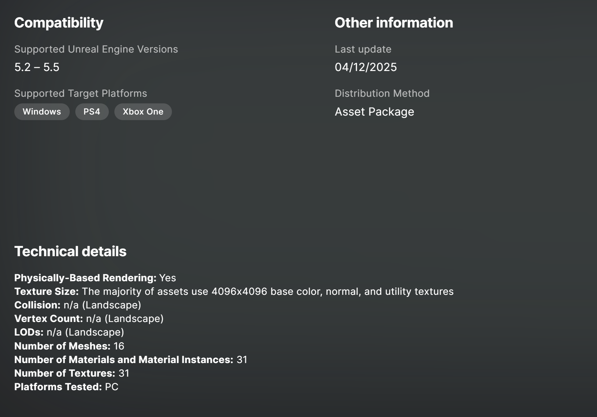

# 1. Unreal Engine 마켓플레이스 탐색

## 탐색한 무료 에셋

### MW Landscape Auto Material

- **카테고리**: 환경(Environment) - Landscape Material
- **라이선스**: 프로젝트 사용 가능 (Unreal Engine 라이선스 내 무료 사용 가능)
- **파일 크기**: -
- **지원 엔진 버전**: Unreal Engine 5.2 ~ 5.5
- **지원 플랫폼**: Windows, PS4, Xbox One
- **설명**:  
  MW Landscape Auto Material은 다섯 개의 프로시저럴 레이어를 사용하여 다양한 지형(material)을 빠르게 설정할 수 있는 스마트 랜드스케이프 오토 머티리얼입니다.  
  사용자는 자신의 텍스처와 식생(foliage)을 적용하여 커스텀 환경을 만들 수 있으며, 빠른 프로토타이핑과 고성능을 목표로 제작되었습니다.  
  또한 모듈화되어 있으며 쉽게 커스터마이징할 수 있도록 설계되었습니다.

---

# 2. 다운로드 인증하기

## 다운로드한 에셋 이름

- **MW Landscape Auto Material**

## 다운로드를 결정하게 된 계기

Unreal Engine에서 자연 환경이나 오픈월드 지형을 빠르게 구현하는 데 있어  
효율적인 랜드스케이프 머티리얼이 필요하다고 느꼈습니다.  
MW Landscape Auto Material은  
- 다양한 프로시저럴 레이어 지원,  
- 빠른 프로토타이핑 가능,  
- 고성능을 목표로 설계된 점 등  
실제 프로젝트나 레벨 디자인 실습에 매우 유용할 것이라 판단하여 다운로드하게 되었습니다.

특히, 커스텀 텍스처를 적용하거나 식생(Foliage)을 쉽게 추가할 수 있어  
향후 직접 만든 월드에 적용해보고 싶은 기대감이 컸습니다.

---

