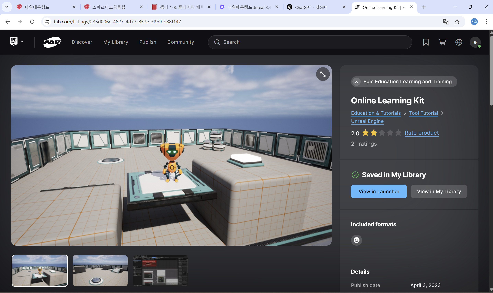
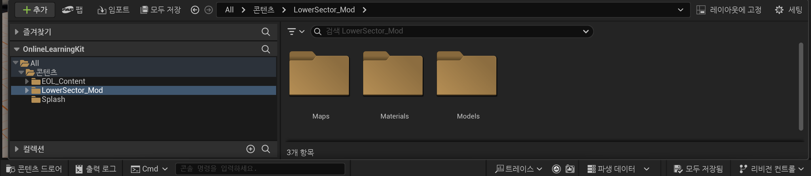
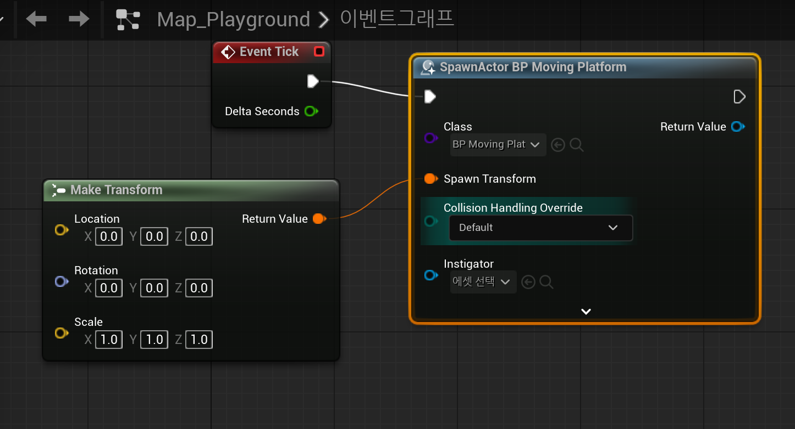

# 언리얼 엔진 블루프린트 강의 정리

## 🎯 수업 목표

- 블루프린트를 활용하여 플레이어 캐릭터의 움직임을 구현할 수 있다.
- 캐릭터의 이동 구현에 필요한 핵심 노드를 학습합니다.

---

## 🗂️ 목차

1. 에셋 다운로드 및 프로젝트 셋업  
2. 플레이어 캐릭터 블루프린트  
3. 향상된 인풋 시스템  
4. 중간 점검: 점프 구현  

---

## 1. 에셋 다운로드 및 프로젝트 셋업

### 1-1. Fab에서 에셋 다운로드
- `Online Learning Kit`, `Lower Sector Building Kit` 검색 후 ‘내 라이브러리’에 추가
- 사용 중인 언리얼 엔진 버전 확인 필수  

### 1-2. 프로젝트 생성 및 에셋 적용
- 언리얼 런처에서 새 프로젝트 생성
- `Switch Unreal Engine version`으로 버전 변경 가능  
- 강의 자료에 업로드 되어있는 zip파일 다운로드 후 진행행

### 1-3. 에셋 둘러보기
- 콘텐츠 브라우저에서 `EOL_content`, `Lower Sector Building Kit` 확인  

📝 **나의 느낀 점**  
- 버전 변경에서 5.4버전을 재설치해야 하는 지 고민이 많았는데, 강의 자료에 zip파일이 업로드 되어있어서 수월하게 진행할 수 있었습니다.
- 업로드 되어있는 파일 덕분에 문제 없이 진행 할 수 있었지만, 버전변경 하는 방법에 대해 확실히 이해해서 버전 변경이 필요한 프로젝트를 진행할 경우에는 차질없이 진행 될 수 있도록 확실한 이해가 필요합니다. 

---

## 2. 플레이어 캐릭터 블루프린트

### 2-1. Blueprint Class 생성
- `Blueprints` 폴더 생성 → `Spawn Actor BP Moving plattform` 클래스 선택 → `BP_MovingPlattform` 생성  

### 2-2. moving plattform 메시 설정
- 게임플레이시/0,0 위치에 생성 되도록 설정정

