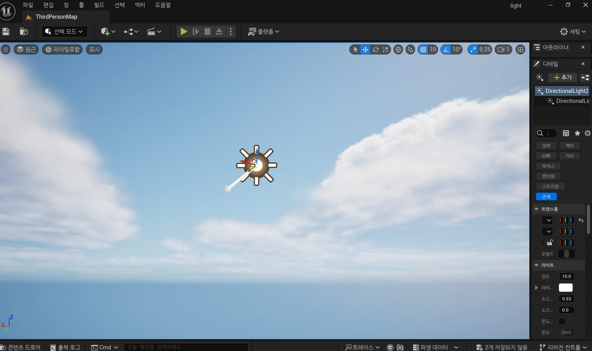
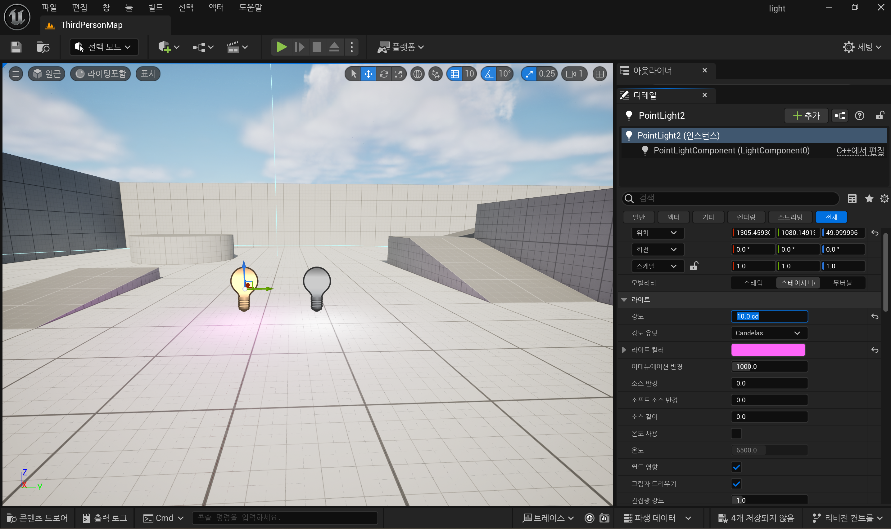
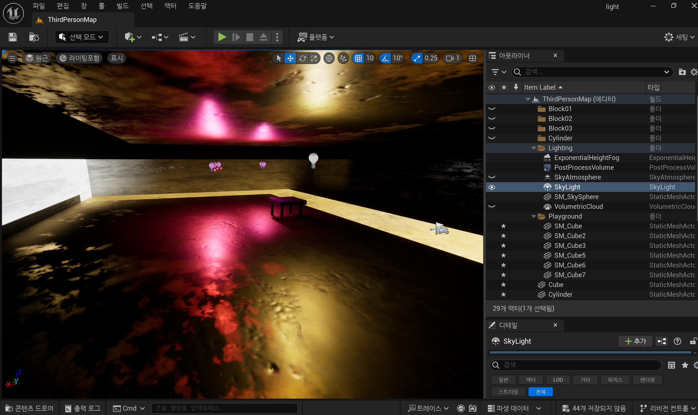

# TIL - 조명과 머티리얼 기본 적용

## 1. 오늘 배운 개념 요약

- **조명(Light)의 종류**
  - **Directional Light**: 씬 전체에 태양처럼 빛을 비추며 그림자 방향성 명확.
  - **Point Light**: 전구처럼 특정 지점에서 모든 방향으로 빛을 방사.
  - **Spot Light**: 후레쉬처럼 특정 방향에 원뿔 형태로 빛을 집중.

- **머티리얼(Material)**
  - 3D 오브젝트에 색상, 반사, 광택, 질감 등을 표현할 수 있는 재질.
  - **Material Instance**를 활용하면 기존 머티리얼을 기반으로 색상만 빠르게 변경 가능.

---

## 2. 구현 과정 요약

### [Step 0] 프로젝트 생성
- 템플릿: Third Person
- Starter Content 포함 ✅

### [Step 1] 조명 추가
- Directional Light 1개 (태양 역할)

- Point Light 2개 (실내 전등 역할)
  - 밝기(Intensity)와 색상(Color) 각각 다르게 설정

### [Step 2] 머티리얼 적용
- StarterContent > Materials 폴더에서 골라 사용
- 바닥: **M_Metal_Gold**
- 벽: **M_Concrete_Poured**
- 테이블: **M_Wood_Walnut**
- Material Instance 생성 → 색상만 다르게 적용해 테스트

### [Step 3] 라이트와 그림자 확인
- 큐브, 스피어, 실린더 등을 다양한 위치에 배치
- 그림자의 방향 및 세기 확인 (Directional Light 회전 포함)
- 낮/밤 느낌 비교 (Directional Light 색상/강도 조절)

---

## 3. 스크린샷

### ▶ 낮 느낌 씬

### ▶ 밤 느낌 씬

---

## 4. 사용한 머티리얼 정리

| 오브젝트 | 머티리얼 이름         |
|----------|------------------------|
| 바닥     | M_Metal_Gold           |
| 벽       | M_Concrete_Poured      |
| 테이블   | M_Wood_Walnut          |
| 의자     | MI_M_Wood_Walnut_Blue (Instance) |

---

## 5. 느낀 점 & 개선하고 싶은 점

- 조명과 머티리얼 하나만 바꿔도 분위기가 크게 바뀐다는 것을 체감했다.
- Spot Light를 활용한 연출은 게임 내에서 극적인 장면 연출에 효과적일 것 같다.
- Material Instance의 활용이 실시간 테스트에 유용했으며, 향후 블루프린트와 연동하면 더 많은 자동화를 할 수 있을 것 같다.
- 다음에는 더 다양한 텍스처와 라이트 세팅을 활용해 실내-실외 환경을 나눠 표현해 보고 싶다.

