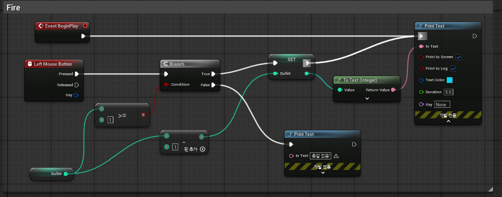
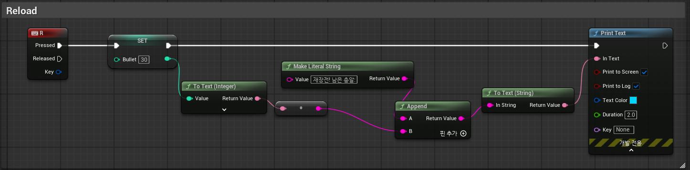
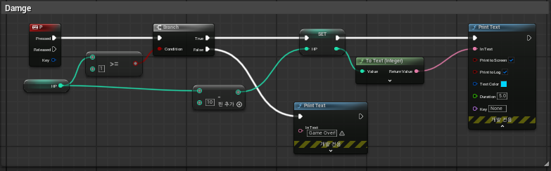
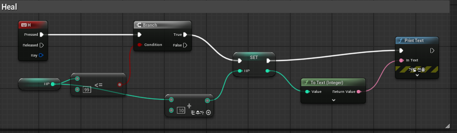

# 🎮 2025-05-21 Unreal Engine TIL

## 📌 학습 목표
- 블루프린트를 활용하여 **총알 발사 / 재장전 / 피격 / 회복 시스템** 구현
- 변수와 조건문을 적절히 활용하여 플레이어 상태를 관리하는 로직 작성

---

## 🔫 1. 총알 발사 (Fire)

- 마우스 좌클릭 시 발사
- `Bullet`이 1 이상일 경우만 발사 가능
- 발사 시 `Bullet - 1` 처리 후 현재 잔여 총알 수 출력
- 총알이 없으면 `"총알 없음!"` 출력

📸 **[Fire]**  

---

## ♻️ 2. 재장전 (Reload)

- `R` 키 입력 시 총알 수를 `30`으로 설정
- `"재장전! 남은 총알: 30"` 형식으로 출력 (문자열 연결 사용)

📸 **[Reload]**  

---

## 💥 3. 총알 피격 (Damage)

- `P` 키 입력 시 HP가 감소 (`Damage = 10`)
- HP가 10 이상일 경우에만 실행
- 피격 시 현재 체력 출력
- HP가 10 미만일 경우 `"Game Over"` 메시지 출력

📸 **[Damage]**  

---

## 💉 4. 체력 회복 (Heal)

- `H` 키 입력 시 HP 회복 (`Heal = 10`)
- HP가 100 미만일 경우에만 회복 가능
- 회복 후 현재 체력 출력

📸 **[Heal]**  

---

## 🧪 실제 실행 결과

- 모든 기능 정상 작동 확인 완료
- 각 기능의 조건 분기 및 변수 감소/증가 확인
- PrintText 출력을 통해 디버깅 수월함

---

## 💡 느낀 점

- 조건문(Branch)의 활용 중요성 체감
- 변수 값 변경 후 바로 출력하는 로직 구조 익숙해짐

---

## 📚 추가 학습 예정

- **Actor 간 충돌로 실제 피격 이벤트 발생시키기**
- **UI를 통한 HP / Bullet 상태 표시**
- **사운드 및 파티클 연계 추가**

---