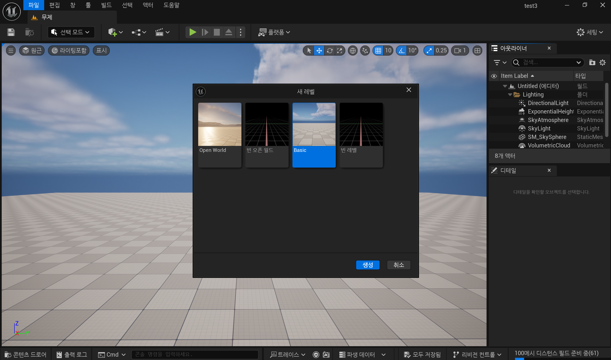
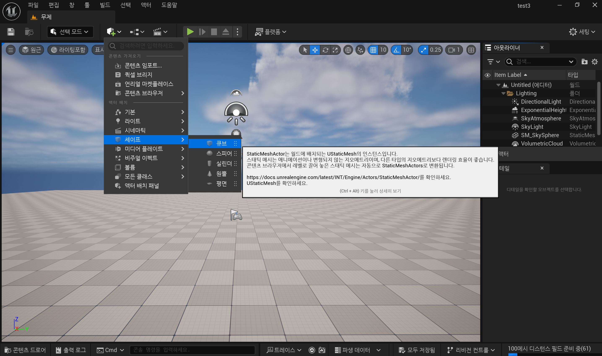
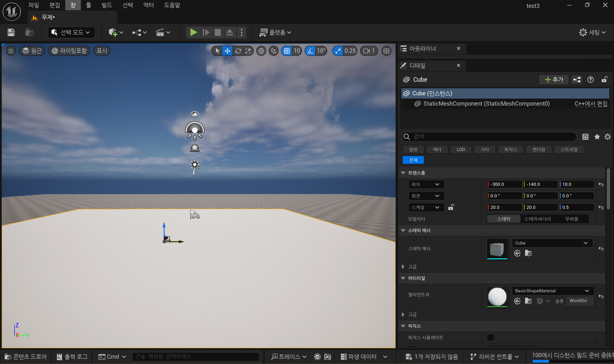
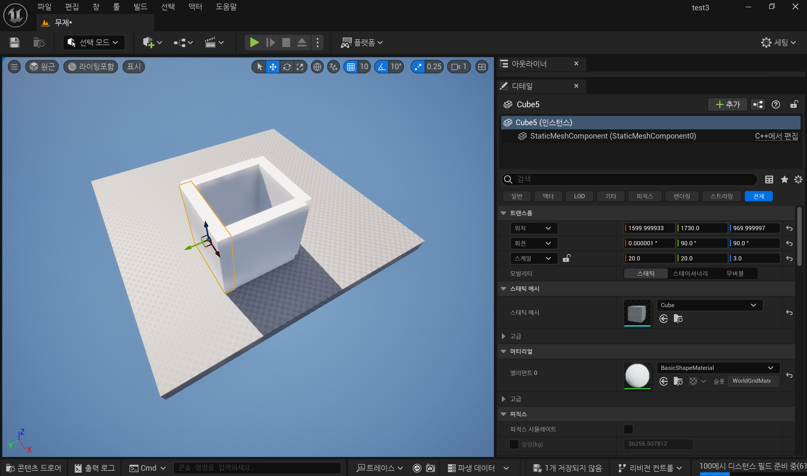
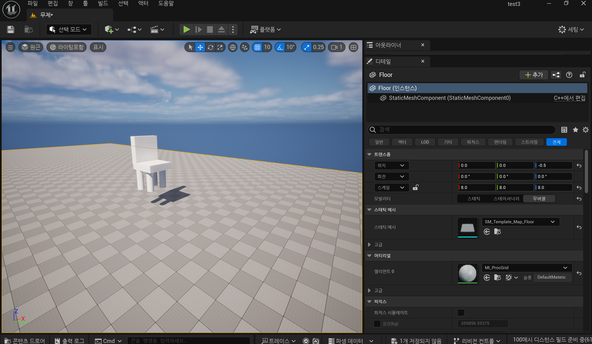
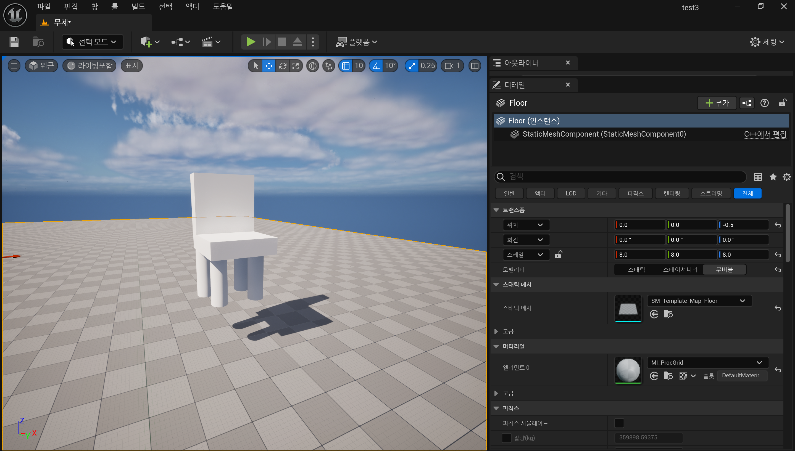
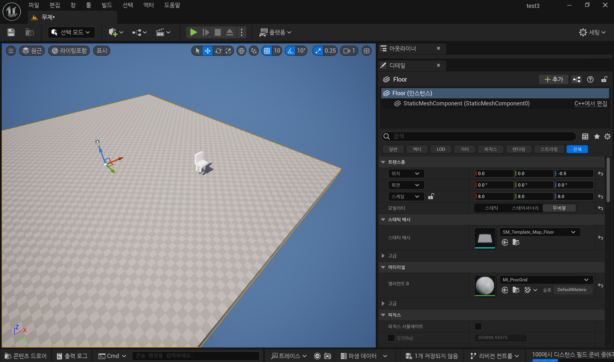

# 🎮 TIL - 레벨 생성 및 기본 오브젝트 배치

## 1. 오늘 배운 개념 요약

- **레벨(Level)**  
  언리얼 엔진에서 하나의 맵 혹은 공간을 의미하며, 프로젝트 내에 여러 레벨을 만들 수 있음.

- **Static Mesh**  
  움직이지 않는 3D 오브젝트 (예: 벽, 바닥, 건물 등). 다양한 Static Mesh를 조합하여 레벨을 구성함.

- **Place Actors 패널**  
  다양한 오브젝트를 끌어다 배치할 수 있는 창.

- **뷰포트(Viewport)**  
  3D 공간을 확인하고 조작하는 창. 마우스 우클릭 + `W/A/S/D`로 이동 가능.

---

## 2. 구현 과정 요약

### ✅ Step 1: 새 레벨 만들기
- 메뉴: `File → New Level → Basic`
- 이름: `MyFirstLevel` 로 저장

---

### ✅ Step 2: 바닥 만들기
- Place Actors 패널에서 `Cube` 선택
- Scale 설정: X: 20, Y: 20, Z: 0.5
- 바닥 역할로 배치

---

### ✅ Step 3: 벽 만들기
- Cube 4개를 복사하여 벽처럼 네 방향에 배치
- Scale 설정: Z: 3.0, X 또는 Y: 20

---

### ✅ Step 4: 오브젝트 배치 연습
- 작은 Cube를 활용해 테이블, 의자처럼 배치
- Cylinder, Sphere 등도 추가하여 다양한 형태로 구성

**📸 이미지 (Step 4)**  

---

### ✅ Step 5: 카메라 시점 바꾸기
- 마우스 우클릭 + `W/A/S/D`로 자유롭게 이동
- 오브젝트 크기 및 배치 상태 확인

**📸 이미지 (Step 5)**  

---

## 3. 느낀 점 & 개선하고 싶은 점

- 처음으로 레벨을 직접 구성해보며 생각보다 많이 버벅거리는 느낌이 들었음.
- 단축어(명령어)를 활용해서 이것 저것 해보고 싶었지만, Alt + 드래그 기능으로 복사를 하려는데 잘 되지 않아 강의를 다시 봤음.
- 오브젝트 복사 및 이동 시 더 정확한 정렬 도구를 활용하면 효율이 좋아질 듯.

---

